### 为什么学习控制系统

- 控制理论是将所有不同工程领域缝合在一起的**粘合剂**
    - 理解控制基础，能解决各种工程问题
    - 不只是控制工程师，对**任何工程师**都适用
- **电气工程师示例**：设计**开关电源调节器**（几乎所有电气设备都有）
    - 依赖**反馈**
    - 设计不当会**不稳定**
- **通信工程师示例**：构建**自动增益控制电路**

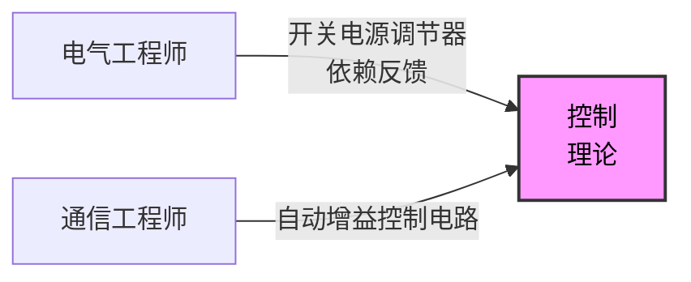

- **机械工程师示例**：设计**隔振系统**，用于对振动敏感的系统（如电机安装）
    - 处理结构中的振动和阻尼问题
- **土木工程师示例**：设计**主动或被动阻尼系统**，用于高层建筑和地震区
- **工业工程师示例**：设计**机器人装配线**，或调整**PID控制器**（工业机器人应用中无处不在）
- **航空航天工程师示例**：解决**飞机颤振**问题（空气动力与结构弹性相互作用的现象）

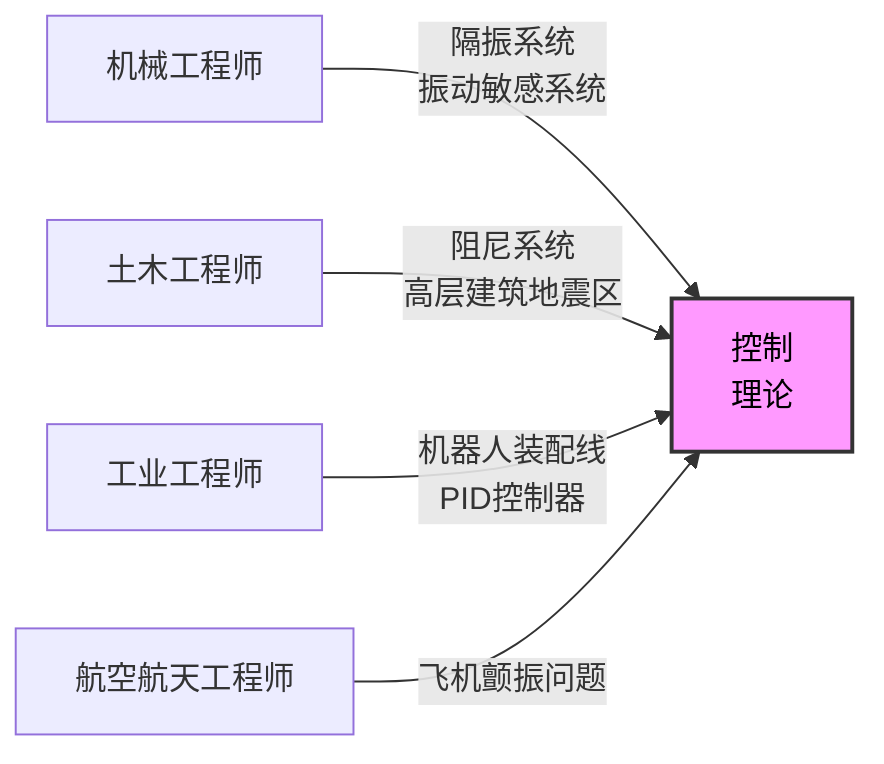

- **控制理论跨越工程学科的总结**：如飞机颤振中结构刚度与空气动力学的相互作用
    - 这些只是控制理论连接多领域的几种方式
- **日常生活视角**：用力放下酒杯时，它以固定频率发出声响（叮当声）
    - 控制理论让普通活动（如酒杯振动）从新角度理解

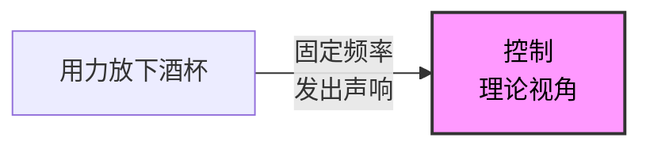

### 阻尼在振动系统中的作用

- **自然阻尼**：能量通过热量和声音消散，导致振幅随时间逐渐减小，振动最终停止
- **增加阻尼**：用手指触摸振动物体，系统阻尼增大，能量更快消散

```mermaid
xychart-beta
    title "振幅衰减对比"
    x-axis ["时间 t"]
    y-axis "振幅" 0 --> 1
    line "正常衰减" [1, 0.8, 0.6, 0.4, 0.2, 0]
    line "增加阻尼" [1, 0.7, 0.4, 0.2, 0.05, 0]
```

- 阻尼理解振动衰减机制，提供控制理论基础
- **振动酒杯的工程应用**：本质上是**半球形谐振陀螺仪**（hemispherical resonating gyroscopes）的技术基础
    - 用于某些**潜艇**和**卫星**进行**航位推算**（dead reckoning）

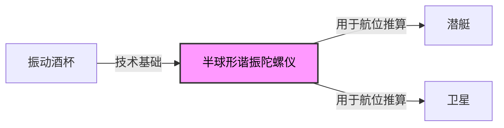

- 阻尼增加的快速能量消散机制：触摸振动物体导致声音更快消失，提供振动控制的直观理解

### 航位推算与科里奥利效应

- **航位推算（Dead reckoning）**：知道起始位置，然后利用测量到的速度随时间推移来计算当前位置
    - 振动酒杯是**半球形谐振陀螺仪**的技术基础，用于某些**潜艇**和**卫星**

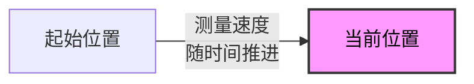

- **旋转振动酒杯**：用手指慢慢旋转时，振动的**驻波**由于**科里奥利力**而以略微不同的速率旋转
    - **科里奥利效应**在旋转坐标系（如地球）中可观测
    - 是**风暴旋转方向**的原因

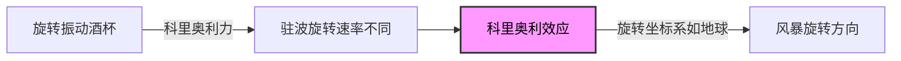

- 酒杯边缘示意图：**Node（节点）**和**Anti-node（反节点）**，频率关系 `wineglass ∝ ω_antinode`
- **科里奥利效应扩展**：北半球与**南半球**风暴旋转方向相反
        - 驱动地球天气系统的**复杂微分方程**

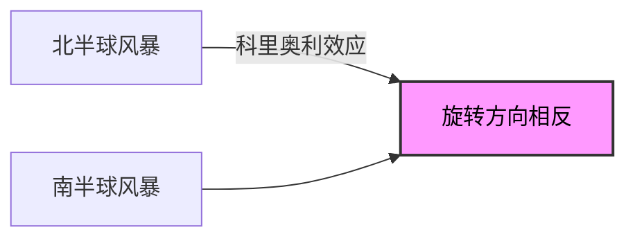

- **天气系统模拟思考**：尝试将复杂系统近似为**低阶常微分方程**，编写计算机模拟以预测全球天气模式
- **控制系统理论核心**：远超PID控制器调谐或倒立摆稳定
    - **构建模型**
    - **模拟预测**
    - **动态交互**
    - **过滤噪声**

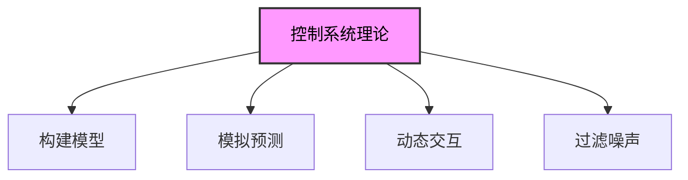

- 酒杯驻波与反节点由于**科里奥利力**旋转，连接到旋转陀螺仪示意图（Node与ω\_wineglass）

### 控制系统理论的实际可及性

- **抵御外部干扰**：拒绝外界扰动
- **设计与选择**：传感器和执行器
- **系统测试**：确保在意外环境中按预期运行
- **人人可及**：无需强大数学背景理解，如触摸酒杯去除能量
- **学习建议**：观看本课程，并提出大量问题

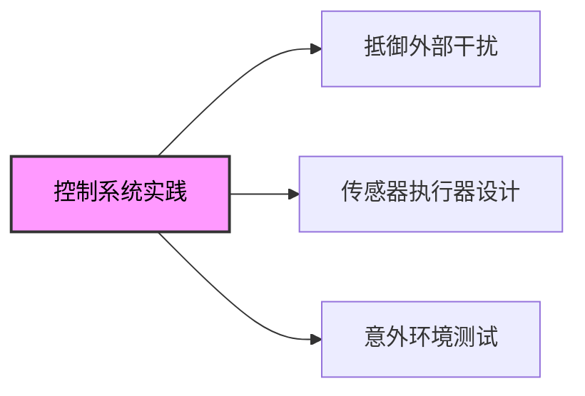

- **原始方程（Primitive Equations）**：地球大气环流示意图，驱动天气系统的复杂微分方程基础

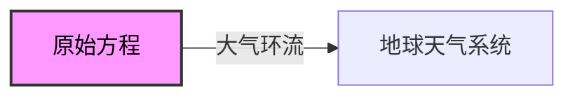

### 控制系统的定义

- **控制系统**：改变系统未来状态的**机制**
    - 行为或结果**趋向于期望状态**，而非简单改变状态

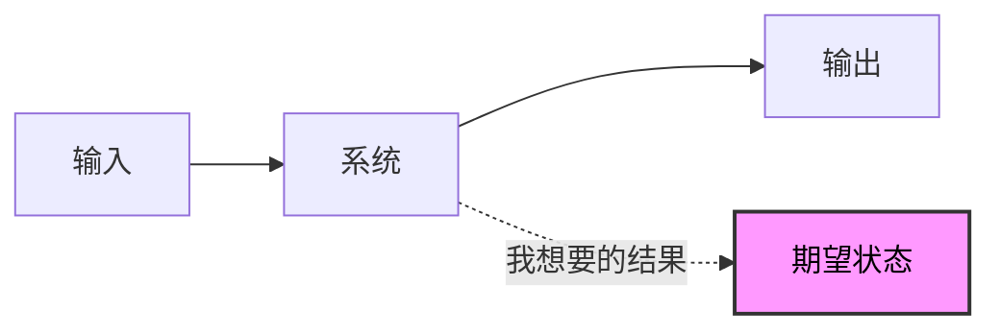

- **控制理论**：数学分支，关注**选择合适输入的策略**
    - 处理**如何改变系统以得到想要结果**
- **没有控制理论**：设计者**局限于选择合适输入**（被动方式）

### 开环控制系统基础

- **控制系统定义**：改变系统未来状态的机制
    - **控制理论**：选择合适输入的策略

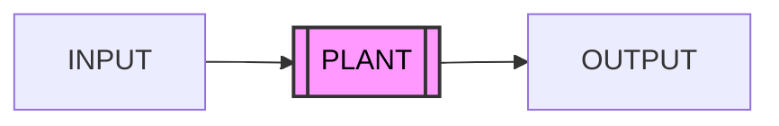

- **开环控制系统**：输入不依赖系统输出
    - 被控对象（plant）接收输入，随时间响应产生输出
    - 用于具有明确输入-输出行为的简单过程
        - 示例：**洗碗机**

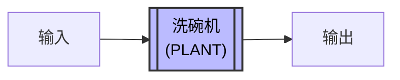

- **问题导向**：如何改变这个系统以得到想要的结果？
- **洗碗机开环控制细节**：用户设置洗涤时间后，洗碗机按固定时间运行清洗餐具
    - 无论餐具初始清洁度如何，都不调整
    - 若餐具已干净，仍运行全时长
    - 若放满蛋糕的10盘，时间可能不足以洗净


- **开环控制另一个例子**：草坪洒水系统
    - 输入不依赖输出，适用于简单固定过程
- **草坪洒水系统开环控制**：用户设置定时器控制洒水器运行时间
    - 被控对象为草坪，输出为**土壤湿度**
    - 即使外面下雨仍会运行


- **更复杂开环例子**：无巡航控制的车速控制
    - 用杆子卡在座位前和油门间，踩一半油门
    - 输出为**速度**（SPEED）


- **汽车开环控制细节**：输入为**油门踏板位置**，被控对象为汽车
    - 在平坦道路上，汽车加速直到施加力与**摩擦力**平衡，停止加速并保持**恒定速度**
    - **上坡或下坡**时，不改变输入（油门），汽车会**减速或加速**，无法维持期望恒速

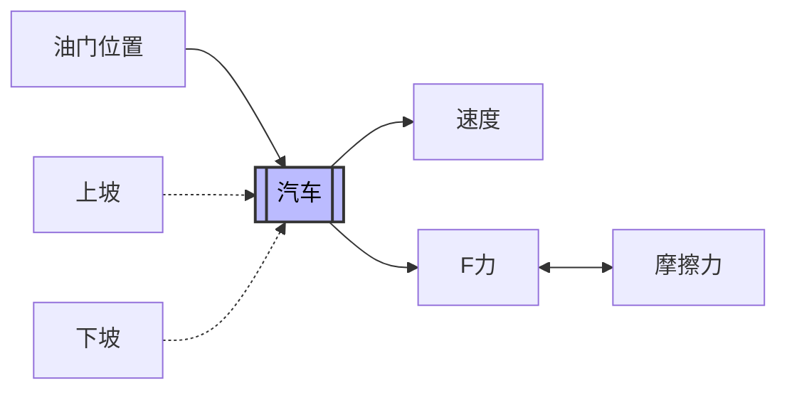

- **开环控制主要缺点**：输入无法补偿系统变化（如地形变化）
    - 系统无反馈机制调整输入，导致输出偏离期望状态

### 闭环控制系统基础

- **闭环控制系统**：根据系统输出调整输入，以应对系统变化（如开环中的地形问题）
    - 也称为**反馈控制**、**负反馈控制**或**自动控制**（本讲座中互换使用）

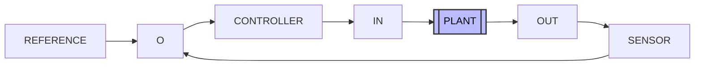

- **闭环工作原理**：用**传感器**测量系统输出，与**参考信号**（期望状态或指令状态）比较
    - 生成**误差项**，输入**控制器**调整输入
    - 形成反馈回路，补偿系统变化
- **与开环对比**：开环输入固定，无法变；闭环输入随输出变化，趋向期望状态

### 闭环控制系统基础

- **闭环控制系统**（也称反馈控制系统）：输入依赖系统输出，形成反馈环路
    - 结构包括：**参考信号**、**控制器**、**被控对象（plant）**、**传感器**

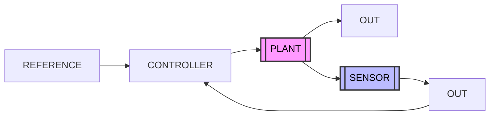

- **负反馈机制**：传感器读取输出，反馈到**比较器**，减去反馈信号产生误差
    - 误差转换为系统输入值，形成**控制环路**
- **洗碗机闭环控制示例**：添加**清洁传感器**测量盘子清洁度
    - **参考信号**：期望清洁度水平
    - 根据误差调整清洗过程

```mermaid
flowchart LR
    A[Clock] --> B[TIME] --> C[[Dishwasher]] --> D[CLEAN DISHES]
    C --> E[CLEAN SENSOR]
    style C fill:#bbf,stroke:#333,stroke-width:2px,color:#000
```