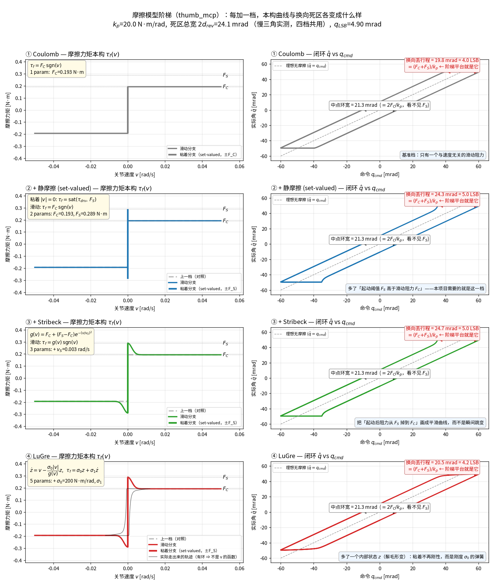

# Transmission Gap：丝杠灵巧手的换向死区

> [!abstract] 一句话
> `thumb_mcp` 与 `thumb_cmc_pitch` 在丝杠后多一级 **17:1 折返减速箱**，把总减速比推到 $N_{eq}\approx1400\sim1800$（四指仅 63~135）。摩擦按 $N_{eq}$ 的**一次方**折算，于是同一份电机侧摩擦在关节端被放大 11~28 倍，形成 **24 mrad（≈5 个反馈 LSB）的换向死区**——这就是阶梯响应的全部来源。
>
> **要建的就是这一个现象，两个参数（$F_C$、$F_S$）足够。**

> [!tip] 读者导引：本文反复出现、但只在这里定义一次的量
> - **LSB**：反馈与命令共用 8-bit 栅格，1 LSB = 关节量程 / 255（rad）。所有"几个 LSB"都是用它做单位；比 1 LSB 小的命令增量到不了手。
> - **死区 / 换向丢行程**：正向滑动稳定后 target 领先 current 一个偏置 $d_C$；要反向，必须把 target 拉回到落后 $d_S$，关节才重新起动。中间这段 $d_C+d_S$ 内命令在走、关节不动，就是"换向丢行程"（§1.1），也是阶梯响应的平台。
> - **$N_{eq}$**：电机转角对关节转角的总比值 $\Delta\theta_m/\Delta\theta_j$，推导见 [[LinkerSysId#§3 直线→关节折算：等效直线质量变成关节 armature|LinkerSysId §3]]；含齿轮箱时 $N_{eq}=2\pi r(\theta)N_{gear}/l$（[[LinkerSysId#§4 拇指第二例：多一级 17:1 折返减速箱|LinkerSysId §4]]）。
> - **$r(\theta)$**：丝杠推杆作用点到关节转轴的垂直力臂，随关节角 $\theta$ 变（连杆机构），四指代表值 ≈12 mm。
> - **$N_{gear}$**：丝杠前面的齿轮减速比，四指为 1，拇指 `thumb_mcp` / `thumb_cmc_pitch` 为 17。
> - **$k$**（出现在 $J_{arm}=k\,J_{rotor}N_{eq}^2$ 与 $\tau^m=\tau^j/(kN_{eq})$）：连杆几何/效率修正因子，把"理想 $N_{eq}$"修到实际传动，四指近似取 1；本文未单独标定，**待核实**。
> - **set-valued 摩擦**：粘着时摩擦力矩不是速度的函数，而是一个区间 $[-F_S,F_S]$ 内"恰好抵消驱动力矩"的任意值（$\mathrm{sat}(\tau_{drv},F_S)$）；滑动时退回 $F_C\,\mathrm{sgn}(v)$。$F_C$ = 库仑滑动摩擦，$F_S$ = 静摩擦起动阈值，$\rho=F_S/F_C$。
> - **激励名**：`chirp` = 扫频正弦（定 $T_1$、$T_f$）；`三角` = 恒速往返（定 $d_C$，速度外推）；`min_step` = 静止下逐 LSB 阶梯（定 $d_S$）；`阶跃` = 大幅跳变（定纯延迟 $T_d$）。

---

## 〇、边界：这份文档管什么

兄弟文档 [[Actuator2RigidDynamicsModel_gap]] 管**电流环 → 电机轴力矩**（反电动势、$K_t(T)$、串级嵌套）。本文管紧接其后的**电机轴力矩 → 关节力矩**：

$$\tau_{joint} = \underbrace{\left( K_t i - J_m\ddot\theta_m - C_m\dot\theta_m \right)}_{\text{Actuator 文档}} \cdot \underbrace{N\eta - \tau_{fric}}_{\text{本文档}}$$

命名取 `Transmission` 而非 `Mechanics`：兄弟文档已把 `[[Dynamics]]`（刚体）与 `[[ContactMechanics]]`（接触）列为平级独立笔记，用 `Mechanics` 会同时宣称那两块。

**遇到一个现象先判归属**：

| 现象 | 归属 | 判据 |
|---|---|---|
| 高速无力、长时间出力下降 | Actuator | 与速度 / 温度相关 |
| **换向卡顿、阶梯响应** | **本文** | 与 $\mathrm{sgn}(\dot q)$ 翻转绑定 |
| 反驱不对称、单向自锁 | 本文 | 与外力方向绑定 |
| 起步后过冲 | 待判（§4.4） | 随粘住时长增长 → Actuator 内环积分 |
| 命令高频成分被滤掉、首动固定延迟 | Actuator | 与 $\mathrm{sgn}(\dot q)$ 无关、随频率变（[[Actuator2RigidDynamicsModel_gap#4.2 延迟预算表：从策略到电机轴|延迟预算表]]） |
| 指令 / 反馈的整数 LSB 阶梯 | 量化层 | 与 8-bit 栅格对齐（[[sim2real]] 固件/通信/量化层） |

---

## 一、现象：真机上看到什么

### 1.1 三阶段换向

正向运动稳定后，target 与 current 保持一个恒定偏置；要反向，必须先把 target 拉回、再压过一段距离，关节才重新起动；换向完成后新 target 立刻得到响应。三段各对应一个闭式量，推导只用一行力平衡（正向滑动时摩擦取 $-F_C$，故 $k_pe=+F_C$；要反向必须把误差压到 $-F_S$）：

$$\underbrace{d_C=\frac{F_C}{k_p}}_{\text{滑动偏置}},\qquad
\underbrace{d_C+d_S=\frac{F_C+F_S}{k_p}}_{\text{换向丢行程 ← 阶梯平台}},\qquad
\underbrace{d_S=\frac{F_S}{k_p}}_{\text{起动阈值}}$$

> [!important] 换向丢行程是 $(F_C+F_S)/k_p$，**不是 $2F_C/k_p$**
> 写成后者等价于默认 $F_S\equiv F_C$。当前仿真参数表里 $\tau_c=k_p\cdot b_{\rm rad}$ 的取法就隐含了这一点。

### 1.2 三种独立测法互证到 8% 以内

| 测法 | 波形 | 有效窗 | `thumb_mcp` 读数 |
|---|---|---|---|
| **A 速度外推**（作准） | 慢三角，≥2 档恒速 | 需含 $v\le0.01$ rad/s | $d_{\rm rev}=12.06$ mrad |
| **B 换向死行程** | 同份三角的换向点 | **仅 $v\le0.015$ rad/s** | 12.25 mrad |
| **C 静止逐级**（min_step） | 整数 LSB 阶梯 | 准静态 | 13.03 mrad |

越窗会静默给出错的数：方法 B 在 0.03 档已污染 30%，0.10 档垮到 0.4~1.4 mrad。

min_step 还多给一条 chirp 永远给不出的信息——把 $\rho$ 夹住：

$$d_C+d_S=24.51\ \text{mrad},\quad d_S\le14.71\ \text{mrad}
\;\Longrightarrow\; \rho\equiv\frac{F_S}{F_C}\le\mathbf{1.50}$$

### 1.3 主要矛盾：阶梯的主体是死区**总宽**，不是 $F_S/F_C$ **比值**

这是全文的枢纽，先把结论摆出来：

| 量 | 大小 | 由什么决定 |
|---|---|---|
| 滑动分量 $d_C$ | **12.08 mrad = 2.46 LSB** | $N_{eq}$（§二） |
| $\rho$ 带来的额外量 $(d_S-d_C)$ | **36.2 mrad = 7.39 LSB** | 材料 $\mu_s/\mu_k$ + 齿轮空程 |
| 死区总宽 $d_C+d_S$ | **60.4 mrad = 12.3 LSB** | 两者之和 |

$d_C$ 由慢三角低速段的速度外推截距给出（两种独立方法互证到 0.2%）；
$\rho=d_S/d_C=4.0$（`thumb_cmc_pitch` 3.5）由平台复现的闭环拟合给出（§6.3、§6.4）。

> [!warning] 两个量都要建对，$\rho$ 不是可以随手固定的小项
> $\rho$ 贡献了死区总宽的 **75%**，比 $d_C$ 还大。
>
> **本节早先写的是「$\rho$ 只值约 1 个 LSB，固定在 1.2~1.5 之间任一值都行」，这是错的。**
> 那个结论来自静止逐级（min_step）实验，而该实验的步长上界恰好把 $\rho$ 卡在 1.5——
> 读到的 1.5 是**实验分辨率的上界，不是被测量的值**。
>
> 一般教训：**当拟合值恰好停在某个实验或搜索的边界上时，它多半是那个边界，不是测量结果。**
> 判别方法是把那个边界放宽再拟一次：若值跟着边界走，它就不是测量结果。

---

## 二、丝杠结构：$F_S$ 会不会很大

### 2.1 两个不同的幂次

由动能守恒 $\frac12 J_{rotor}\omega_m^2=\frac12 M_{eq}v^2=\frac12 J_{arm}\dot q^2$ 逐级折算：

$$N_{eq}=\frac{2\pi\,r(\theta)\,N_{gear}}{l},\qquad J_{arm}=k\,J_{rotor}N_{eq}^2$$

> [!important] 全文最关键的一处
> $$\text{惯量折算}\propto N_{eq}^2\qquad\text{摩擦折算}\propto N_{eq}^{\,1}$$
> 惯量按**能量**折算（速度比的平方），摩擦按**力矩**折算（杠杆比的一次方）。

**为什么幂次不同——把两条推导并排写出来**（惯量的动能推导已在上式；摩擦用虚功 / 功率平衡）：

1. 运动学：$\omega_m=N_{eq}\,\omega_j$（$\omega_m$ 电机角速度，$\omega_j$ 关节角速度）。
2. 理想传动（暂取 $\eta=1$）两侧功率相等：$\tau_m\omega_m=\tau_j\omega_j$。
3. 把 1 代入 2：$\tau_m N_{eq}\omega_j=\tau_j\omega_j\;\Rightarrow\;\tau_j=N_{eq}\,\tau_m$。**力矩按一次方放大。**
4. 电机轴上的库仑摩擦 $\tau_C^m$ 是一种力矩：关节转 $\delta\theta_j$，电机轴转 $N_{eq}\delta\theta_j$，耗散功 $\tau_C^m N_{eq}|\delta\theta_j|$；要用关节侧一个等效摩擦 $F_C$ 表示同样的耗散，须 $F_C|\delta\theta_j|=\tau_C^mN_{eq}|\delta\theta_j|$，故 $F_C=N_{eq}\tau_C^m$（计入几何因子写作 $kN_{eq}\tau_C^m$）。
5. 惯量为什么多一个 $N_{eq}$：关节侧要克服转子的惯性力矩 $\tau_j=N_{eq}\cdot(J_{rotor}\ddot\theta_m)$——这里第一个 $N_{eq}$ 与第 3 步相同（力矩放大）；再用 $\ddot\theta_m=N_{eq}\ddot\theta_j$（加速度也被放大），得 $\tau_j=N_{eq}^2J_{rotor}\ddot\theta_j$。库仑摩擦的大小与 $\ddot\theta$、$\dot\theta$ 无关，所以没有第二个 $N_{eq}$。

完整的逐步 worked example（四指 + 拇指两例）见 [[LinkerSysId#§5 摩擦按 N 的一次方折算、惯量按 N 的平方折算|LinkerSysId §5]]。

### 2.2 数字

硬件基准（四指见 [[LinkerSysId#§3 直线→关节折算：等效直线质量变成关节 armature|LinkerSysId §3]]，拇指见 [[LinkerSysId#§4 拇指第二例：多一级 17:1 折返减速箱|LinkerSysId §4]]）：

| | 四指电缸 | 拇指折返电缸 |
|---|---:|---:|
| 转子惯量 $J_{rotor}$ | $1.425\times10^{-7}$ kg·m² | $1.4\times10^{-10}$ kg·m² |
| 丝杠导程 $l$ | 0.7 mm | 0.6 mm |
| 前置减速比 $N_{gear}$ | 1 | **17** |

**拇指转子比四指轻 1018 倍。** 折算后：

| 关节 | $N_{eq}$ | $J_{arm}$（CAD） | $F_C$ [N·m] | $d_{\rm rev}$ [mrad] | $k_p$ |
|---|---:|---:|---:|---:|---:|
| 四指 pip | 107.7 | 0.001653 | 0.0191 | 3.81 | 5.0 |
| **`thumb_mcp`** | **1424.2** | **0.000284** | **0.2412** | **12.06** | 20.0 |

$$\frac{N_{eq}^{\rm thumb}}{N_{eq}^{\rm pip}}=13.22,\qquad
\frac{F_C^{\rm thumb}}{F_C^{\rm pip}}=\mathbf{12.66}$$

**两者吻合到 4%**——摩擦确实按 $N_{eq}$ 线性折算，实测证实。
（死区之比只有 3.17×，因为 $k_p$ 也大了 4 倍。）

把库仑摩擦折回**电机侧** $\tau^m=\tau^j/(k\,N_{eq})$，$N_{eq}$ 横跨 16 倍的 12 个关节收敛到 **149~405 μN·m**（拇指落在下端）。**所以拇指不存在任何异常摩擦机制——它只是把同一份电机侧摩擦乘上了一个大 11~28 倍的杠杆。**

### 2.3 $F_S/F_C$ 的结构预测：$N_{eq}$ 约掉了

$$\rho=\frac{F_S}{F_C}\bigg|_{\rm joint}=\frac{k\,N_{eq}\,\tau_S^{m}}{k\,N_{eq}\,\tau_C^{m}}
=\frac{\tau_S}{\tau_C}\bigg|_{\rm motor}\approx\frac{\mu_s}{\mu_k}$$

> [!success] 这就是「$F_S$ 会不会非常大」的答案
> **$F_S$ 的绝对值非常大**（被 $N_{eq}$ 放大 11~28 倍，死区达 5 个 LSB）；
> **但 $F_S/F_C$ 的比值不大**——减速比在分子分母上同时出现，约掉了。
> $\rho$ 是**材料与润滑**的性质，不是传动比的性质。

材料学上的 $\mu_s/\mu_k$：滚动体（滚柱 / 滚珠丝杠）≈ 1.0~1.1；润滑钢-钢滑动（齿轮啮合、轴承）≈ 1.2~1.6。**结构预测 $\rho\in[1.0,1.6]$。**

> [!warning] 实测 $\rho=4.0$ / $3.5$ 落在预测区间之外——这个偏离是有信息的
> 早先的 $\rho\le1.50$ 看似印证了预测，但那是 min_step 实验的分辨率上界（§1.3）。
> 用落进分辨率窗口的三角波重测后，两个关节分别是 4.0 与 3.5，是预测上界的 2 倍多。
>
> **偏离说明「换向平台」不是纯摩擦现象。** 上面那个约分推导只对**力相关**的阻力成立；
> 齿轮组的**机械空程（backlash）是与力无关的运动学量**，$N_{eq}$ 约不掉它，
> 却和 $d_S$ 一样表现为「命令要多走一段关节才动」。模型里没有独立的 backlash 项，
> 它整个被并进了 $F_S$，于是拟出的 $\rho$ 高于纯材料比。
>
> 拆开它需要能独立改 $k_p$ 的实验（摩擦死区 $\propto 1/k_p$，空程与 $k_p$ 无关），
> 而 $k_p$ 不对外暴露。**对仿真复现而言不必拆**——两者对位置轨迹的效果同形；
> 但**不要把这个 $\rho$ 当材料常数外推到别的关节或别的负载**。

### 2.4 自锁：为什么拇指掰不动

螺旋升角 $\tan\lambda=l/(\pi d_m)$。取 $d_m=3\sim5$ mm，拇指 $\tan\lambda=0.038\sim0.064$（$\lambda=2.2°\sim3.6°$），自锁只需 $\mu>0.04\sim0.06$。但丝杠若为**滚动体式（滚珠 / 滚柱，待核实）**（滚动接触，$\mu$ 低，不满足自锁条件；四指上电可反驱是间接证据，见 [[LinkerSysId#§6 反驱对账：高减速比为什么不一定自锁|LinkerSysId §6]]），真正的自锁来自 17:1 减速箱：反驱时高速端阻力矩 $T_h$ 被减速比放大，

$$\eta_{rev}=\left(1-\frac{T_l}{T_{load}}\right)\eta_m-\frac{T_h\,i}{T_{load}}$$

减数项 $T_h i/T_{load}$ 使 $\eta_{rev}$ 可以直接跌破零。**注意这与 $k_p$ 无关**：手感硬来自传动自锁，不来自位置环刚度。

---

## 三、模型只到第 ② 档：为什么 $F_S$ 就够了



四行 = 四档，每行只加一个东西。左列是**本构曲线 $\tau_f(v)$**（灰虚线是上一档，看清多了什么），右列是**闭环 $\hat q$ vs $q_{cmd}$**（死区在这张图上直接量得出来）。

### 3.1 四档的公式、参数与增量

| 档                       | 公式                                                                    | 参数                     | 相对上一档多了什么                           |
| ----------------------- | --------------------------------------------------------------------- | ---------------------- | ----------------------------------- |
| ① Coulomb               | $\tau_f=F_C\,\mathrm{sgn}(v)$                                         | 1：$F_C$                | 基准：一个与速度无关的滑动阻力                     |
| ② **+ 静摩擦（set-valued）** | 粘着 $\tau_f=\mathrm{sat}(\tau_{drv},F_S)$；滑动 $F_C\mathrm{sgn}(v)$      | 2：$+F_S$               | **起动阈值高于滑动阻力**                      |
| ③ + Stribeck            | $g(v)=F_C+(F_S{-}F_C)e^{-(v/v_S)^2}$，滑动 $\tau_f=g(v)\mathrm{sgn}(v)$  | 3：$+v_S$               | 把 $F_S\to F_C$ 的跌落画成平滑曲线            |
| ④ LuGre                 | $\dot z=v-\dfrac{\sigma_0v}{g(v)}z$，$\tau_f=\sigma_0z+\sigma_1\dot z$ | 5：$+\sigma_0,\sigma_1$ | 内部状态 $z$：粘着不再刚性，而是刚度 $\sigma_0$ 的弹簧 |

**$g(v)$ 这条公式拆开只有三件事**（图左列第 ③ 行）：零速时摩擦是 $F_S$；速度大了衰减到 $F_C$；衰减的速度尺度是 $v_S$。**$F_S>F_C$ 那段负斜率就是黏滑（stick-slip）的全部来源**——速度越快阻力越小，构成负阻尼。

### 3.2 各档实际买到多少

同一条慢三角命令、同一份实测死区总宽，量两个量：

| 档 | 中点环宽 | **阶梯平台长度** | 相对上一档 |
|---|---:|---:|---:|
| ① Coulomb | 21.3 mrad | 19.8 mrad | — |
| ② + 静摩擦 | 21.3 mrad | **24.3 mrad** | **+0.93 LSB** ✅ |
| ③ + Stribeck | 21.3 mrad | 24.7 mrad | +0.07 LSB |
| ④ LuGre | 21.3 mrad | 20.5 mrad | **−0.84 LSB** ❌ |

三条读法：

1. **中点环宽四档完全相同（21.3 mrad）。** 因为一旦动起来阻力就是 $F_C$，起动阈值不再出现——**$F_S$ 在环的中点是看不见的，只出现在换向拐角**。这也是量死区时最容易搞错的地方。
2. **第 ② 档买到 +0.93 LSB 的平台，这正是要的东西。** 第 ③ 档再买 0.07 LSB，几乎为零。
3. **第 ④ 档反而倒退 0.84 LSB。** 鬃毛刚度受显式积分稳定性夹住（$k_p+\sigma_0\le\hat\omega^2I_a/h^2$），蠕变率只能到 10%——粘着相以 10% 命令速度蠕动，把平台吃掉了。

> [!danger] LuGre 在这个尺度上不是「更准」，是「更差」
> 它多出来的唯一东西是**预滑移位移** $x_{pre}=F_S/\sigma_0$。而恒等式
> $$\frac{x_{pre}}{d_S}=\frac{F_S/\sigma_0}{F_S/k_p}=\frac{k_p}{\sigma_0}=\text{蠕变率}$$
> 说明：要让粘着真的像粘着（蠕变率 ≤10%），$x_{pre}$ 就**必然** $\le0.1\,d_S=0.30$ 个 LSB。
> **想让它大到测得见，就得把蠕变率放大到 30~50%，那时「粘住」已经变成「缓慢蠕动」。**
> LuGre 的增量价值与它的自洽性互斥。

第 ⑤ 档以上（Dahl / GMS / Maxwell-slip）服务的是精密机床、纳米平台、硬盘磁头伺服——**它们的定位精度要求本来就落在预滑移尺度内**。它们不是更准的模型，是服务另一个精度量级的模型。

### 3.3 结论

**选第 ② 档：set-valued 库仑 + $F_S\ne F_C$。** 两个参数，闭式可测，覆盖 93% 的可观测增量。

第 ③ 档的 $v_S$ 可以固定（取远小于工作速度的值），它只影响拐角形状；顺带一提，它还会引入**黏滑极限环**（图中第 ③ 行左列那条尖峰就是负阻尼），在仿真里是个麻烦而非收益。

---

## 四、怎么拟：只用「发了什么位置、读到什么位置」


### 4.1 数据极简


> [!abstract] 三条约束
> 1. 真机辨识用到的数据越少越好；
> 2. **唯一确定可靠的数据只有位控命令与读回位置**——电流反推力矩必然带偏差与随机性；
> 3. 由此，模型能简则简。

**能简掉一大半**，两步论证：

**① 惯量项整个丢掉。** CAD 的 $I_a$ 给 $\zeta=k_d/2\sqrt{k_pI_a}=11.1$，两极点 $p_1=12$、$p_2=5880$ rad/s，快极点在测量带外 470 倍。被控对象在整个可观测频带内**就是一阶**。

**② 力矩标度整个丢掉。** 除以 $k_p$ 后摩擦只以 $F_C/k_p$、$F_S/k_p$ 出现，故 $(k_p,k_d,F_C,F_S)$ 同乘任意 $c$ 时 $q(t)$ 完全不变。

于是自由空间的换向特性由且仅由**五个量**决定，全部是秒和弧度，**没有一个是力矩、电流、惯量或增益**：

| 参数 | 单位 | 含义 | 由哪条数据定 |
|---|---|---|---|
| $d_C$ | rad | 滑动稳态跟随误差 | 慢三角速度外推截距 |
| $d_S$ | rad | 静止起动阈值 | min_step 逐级 |
| $T_1=k_d/k_p$ | s | 一阶跟随时间常数 | chirp |
| $T_f$ | s | 固件命令预滤波 | chirp |
| $T_d$ | s | 纯传输延迟 | 大幅阶跃首动 |

**验证**：一阶最简模型与完整二阶 set-valued 模型在同一条命令下差 **0.02 mrad = 1/245 个 LSB**。

力矩通道（`torque_pct`）一列都不用——现有 min_step 分析里它已被判为不可用（「本关节恒 0，空载力矩低于 1 个力矩 LSB」）。

> [!success] 代价是一个标量，而且可以事后单独补
> 因为标度退化是精确的：先用位置数据把五个量定死，之后任选 $k_p$，按 $k_d=T_1k_p$、$F_C=d_Ck_p$、$F_S=d_Sk_p$ 换算进引擎——**自由空间行为一字不差，只有接触力整体缩放**。
> 接触标度是一个独立的单参数问题，**不污染摩擦辨识，摩擦辨识也不必等它**。

### 4.2 一个必须补上的自由度：$T_f$


把 $T_d$ 从表里的 45 ms 砍到实测的 10 ms 之后，优化器把 $k_d$ 一路推到网格上界——缺掉的滞后被粘性阻尼接管了。

**原因**：**「首动时刻」与「相位滞后」不是同一个量**。固件的 S 曲线 / 低通平滑对首动几乎没有推迟（滤波器输出一开始就动，只是动得慢），却贡献大量相位。所以阶跃测到的 10 ms 是**纯传输延迟**，chirp 相位要的那几十毫秒是**预滤波时间常数**，两者必须分列。

把 $T_f$ 单列后 $k_d$ 立刻回到 1.668——正是原始 chirp 拟合值。$T_f$ 拟到 120 ms，落在 [[LinkerSysId#7.3 附注：MCU 命令平滑不在 armature 里|LinkerSysId §7.3]] 所记「MCU 规划平滑可达 150 ms」（原项目文档量级，待核实）的范围内；MCU / CAN 时序链路本身见 [[Actuator2RigidDynamicsModel_gap]]。

### 4.3 三种「滞后」必须分开：$T_d$ / $T_f$ / $T_1$

把它们混成一个词，是这类辨识里最常见、也最贵的错误——因为**它们对波形的作用完全不同，
而且只有其中一个是可以靠加大命令幅度测出来的**。

| | 是什么 | 对波形做什么 | 怎么单独测 |
|---|---|---|---|
| $T_d$ **纯传输延迟** | 命令下发到执行器"看见"它的死时间（总线 + MCU 调度） | 整条轨迹**刚性平移**，形状、幅值都不变 | **下发远大于死区的阶跃**，量命令沿到首动的时间 |
| $T_f$ **命令预滤波** | 固件内部的 S 曲线 / 低通平滑 | **幅值随频率衰减**，且产生正比于速度的位置滞后；**几乎不推迟首动** | 频域：幅频曲线的一阶拐点 |
| $T_1=k_d/k_p$ **被控对象** | 闭环一阶跟随时间常数 | 同上 | 频域，且与 $T_f$ 串联难分——靠死区的非线性才分得开（§4.2） |

> [!danger] 为什么阶跃测不出 $T_f$ 和 $T_1$
> 一阶滤波器**输出一开始就动**，只是动得慢。所以"命令→首动"这个观测量对它几乎不敏感，
> 却对 $T_d$ 极其敏感。**阶跃测到的 10 ms 是纯传输延迟，不是全部滞后。**
> 反过来，扫频测到的相位是三者之和，单看它无法归属。

**它们在换向丢行程里的贡献是可分离的**——这是本节最有用的一条：

$$\underbrace{L(v)}_{\text{实测丢行程}}=\underbrace{\frac{F_C+F_S}{k_p}}_{\text{死区：与速度无关}}
+\underbrace{2(T_f+T_1+T_d)\,v}_{\text{滞后：正比于速度}}$$

**做法**：多档恒速换向，$L$ 对 $v$ 做线性回归。
**截距 = 死区（摩擦），斜率 = 2×（总滞后时间常数）。**
这就是慢三角必须采多档速度、且必须有足够慢的档的原因——只有两档时无法检验线性性。

> [!danger] $R^2$ 高**不能**证明这个分解成立——它只证明你取的速度范围太窄
> L25NS 上实测：只用 ≤0.12 rad/s 的档，$R^2=0.9988$，截距 12.08 mrad
> 与独立的几何法差 0.2%，斜率 89 ms——看起来无懈可击。
> 把速度扩到 0.5 rad/s 后，同一条直线的斜率变成 **162 ms**、截距掉到 7.22 mrad，
> $R^2$ 报共线性不足。
>
> **原因是高速端还有一项二次阻尼，曲率在场，一条直线不可能同时给对截距和斜率。**
> 在窄速度范围内，曲线的任何一小段看上去都是直的。
>
> 正确用法：**截距取低速拟合（那里曲率还没起来），滞后取高速或闭环拟合**，
> 不要从同一条回归里同时读两个数。检验方法不是看 $R^2$，是**看拟合能不能外推到
> 没参与拟合的速度档**。

> [!tip] 一个量级感
> L25NS `thumb_mcp`：$T_d=60$ ms、$T_f=85$ ms，总线性滞后约 145 ms。
> **所以"拇指有几十毫秒延迟"这句话如果指的是 $T_d$，量级对了但仍偏小；
> 如果指的是总滞后，那它是 $T_d$ 的 2~4 倍，且相当一部分是固件平滑而不是通信。**
> 这两件事的处置完全不同：前者要改通信/调度，后者要么关固件滤波、要么在模型里显式建 $T_f$。

### 4.4 过冲：先判机理再决定建不建


用 CAD 的 $I_a$ 算得 $\zeta=11.1$——**二阶振铃式过冲在机械路径上不可能发生**。起动瞬间摩擦跌落 $F_S-F_C$ 后，速度在 $I_a/k_d=0.17$ ms 内被阻尼箝住，惯量来不及起作用。所以真机的过冲只可能来自：

1. **一阶追赶过冲**：粘住期间命令持续推进（20 Hz 下一步走 15.7 mrad），起动时误差已远超 $d_S$，释放后以 $(k_pe-F_C)/k_d$ 追赶并冲过命令。**属本文，可建。**
2. **内环积分饱和**：粘住期间积分累积、起动瞬间释放。**属 [[Actuator2RigidDynamicsModel_gap]]，PD+摩擦建不出来。**

> [!tip] 判别实验（现有数据即可）
> **过冲幅度是否随粘住时长增长？** 随时长增长 → 内环积分；与时长无关、上界 $(F_S-F_C)/k_p$ → 一阶追赶。
> 这条必须排在任何拟合之前——若是前者，目标函数里就不该包含过冲项。

---

## 五、落地到 mjlab


引擎侧只做一件事：**把 $F_C$ 与 $F_S$ 写进 `frictionloss`。** 参数的完整讲解
（`solref` / `solimp` / `impratio` / `cone` 各是什么、怎么作用在摩擦锥与摩擦力矩上）
见 [[MuJoCo_Sim2Real_Params#3.1 实测：默认 `solimp` 让 `frictionloss` 退化成弱阻尼|MuJoCo_Sim2Real_Params §3.1]]，这里只给配方与实测。

### 5.1 配方


```xml
<option timestep="0.005" integrator="implicitfast" cone="elliptic" impratio="10"/>
...
<joint name="thumb_mcp" type="hinge"
       armature="0.000568"                            <!-- CAD 转子值 ×2，见下 -->
       damping="0.31"                                 <!-- k_d，逐步按 |v| 改写 -->
       frictionloss="0.242"                           <!-- = F_C = k_p·d_C -->
       solreffriction="0.005 1"
       solimpfriction="0.9999 0.99999 0.001 0.5 2"/>  <!-- 第一个数是关键 -->
```

**$F_S\ne F_C$ 的表达**：`frictionloss` 只有一个标量，所以**每个物理步按当前速度改写它**——

$$f(t)=F_C+(F_S-F_C)\,e^{-(v/v_S)^2}$$

粘着时 $v\to0$、$f\to F_S$（起动阈值高）；滑动时 $f\to F_C$。
**全程留在隐式求解器里，不加任何显式摩擦力矩。** mjlab 侧逐 env 写值走
`MjDexHandBaseEnv.set_dof_physical_props(friction=...)`。

$\rho=F_S/F_C$ 取 **4.0**（`thumb_mcp`）/ **3.5**（`thumb_cmc_pitch`），来源见 §6.4。

**`damping` 也逐步改写**：$h(v)$ 在高速端上翘，需要一项二次阻尼
$k_{d2}|\dot q|$。它**必须折成随速度变的线性阻尼写进 `dof_damping`**，
走隐式积分；写成显式力矩会发散（判据与算例见 [[MuJoCo_Sim2Real_Params]] §7.3）。

> [!warning] armature 是下界，不是辨识值
> 高速换向的平台由「惯走过冲」主导，过冲由等效惯量决定。CAD 转子值下过冲太短，
> $v$=0.5 rad/s 的平台只有真机的 1/4；加大到 2×（`thumb_mcp`）/ 4×（`cmc_pitch`）
> 才补上，但指标在此之上就**饱和**，再大也不变。
> 差额可归于传动件（丝杠螺母、齿轮组、连杆）的反射惯量——CAD 只算了转子。
> 换向数据只能给出下界；要定值需要能激发惯量的独立实验（自由振荡或高频小幅激励）。

### 5.2 两个必须改对的默认值


| 项 | 默认 | 必须改成 | 不改的后果（实测） |
|---|---|---|---|
| `solimpfriction[0]` | 0.9 | **0.9999** | `frictionloss` 退化成弱阻尼：$\tau=0.10$ N·m（远低于 $F_C=0.193$）下关节仍漂 **89 mrad**，本该不动 |
| $k_d$ 放哪 | 显式 PD 力矩 | **关节 `damping` 字段** | $k_dh/I_a=29.4\gg2$，**实测发散**（幅值涨到命令的 40~120 倍） |

> [!danger] 第二条与 armature 是绑定的
> 之前表里拇指 armature 被抬高 37 倍，$k_dh/I_a=0.80<2$，显式 PD 侥幸稳定。
> **换回物理正确的 armature，就必须同时把阻尼改成隐式。**

### 5.3 Isaac Gym 侧


`dof_props["friction"]` 语义不如 MuJoCo 的约束式干净，在 PD 回路里显式实现即可：

$$\tau_f=\begin{cases}
\mathrm{clip}(\tau_{drv},\,\pm F_S) & |v|<v_{th}\ \text{（粘着）}\\
F_C\,\mathrm{sign}(v) & \text{否则（滑动）}
\end{cases}$$

有界力矩、无刚度，不吃稳定性预算。两个后端参数完全一致（$F_C$、$F_S$ 同一组值）。

---

## 六、激励轨迹怎么设计


### 6.1 为什么不能照搬「最优激励」框架


机器人辨识的标准做法（Swevers 等）是把轨迹参数化成有限 Fourier 级数、优化系数使**回归矩阵条件数**最小。**在本问题上结构性不适用**：

1. 它要求模型对参数线性（$\tau=\Phi\theta$）。set-valued 摩擦在粘着相里不是状态的函数而是**约束**，写不出回归矩阵。
2. 它优化「一条轨迹同时激发所有参数」，而摩擦各参数分属**互斥的物理区制**：$d_S$ 只在「静止→起动」那一瞬有信息，$d_C$ 只在恒速滑动时有。一条轨迹全覆盖 = 互相污染。

所以摩擦辨识的标准做法是**按物理区制分实验**（Armstrong-Hélouvry 的四区制框架）。

**还有第三重、更硬的约束**：命令与反馈共用一张 8-bit 栅格（$q_{LSB}$ = 量程/255），命令 20 Hz 下发。比 1 个 LSB 小的命令增量**根本到不了手**，所有阶梯类激励必须在字节域上整数步进。

### 6.2 平台量测的分辨率窗口：速度不能随便选


这是本问题最容易被忽略、代价也最大的一条：**换向平台的可测性对三角波速度有双边约束**。

$$1\ \text{LSB}\;\ll\;v\,\Delta t\;\ll\;d_C+d_S$$

- **下界**（每步命令 ≫ 1 个 $q_{LSB}$）：命令本身走在 8-bit 栅格上。若一步走不满一格，
  命令会连续多个控制周期停在同一个字节上，关节跟着不动——**这段「不动」是量化停顿，
  不是静摩擦**。两者在位置曲线上完全同形，事后无法分离。
- **上界**（每步命令 ≪ 平台长度）：平台只有几十 mrad，若一步就跨过去，挣脱时刻落在两个
  采样点之间，读数被量化成平台长度的整数倍。

窗口宽度就是 $(d_C+d_S)/q_{LSB}$ ——**死区有几个 LSB 宽，可用速度就有几倍跨度**，
通常只有一个数量级左右。

> [!danger] 这个坑的伪装方式：缺口在所有工况下都一样大
> 若所有速度档都落在下界之外，平台读数一律被量化停顿主导——**换工况，污染不变**。
> 表现出来就是「横跨 3.5× 幅值、3.3× 速度、两种下发率，仿真/真机比值稳定在 0.55」，
> 极易被读成「缺口不随工况变 ⇒ 模型缺一整项」。
>
> **「指标在所有工况下都一样差」有两种解释，缺模型项只是其中一种；另一种是所有工况
> 共享同一个测量缺陷。** 判断「激励维度张开了没有」时，必须连**每一档的观测分辨率**
> 一起算，不能只看激励参数的跨度。

**正弦不能替代三角波量平台**：正弦在换向点的速度恰好为零，是最不适合量平台的地方。
两种波形分工不同——

| 波形 | 换向处的速度 | 量什么 |
|---|---|---|
| 三角波 | 全速撞进换向 | 换向平台 → $d_S$、$F_S$ |
| 定频正弦 | 平滑过零 | 增益/相位 → 线性滞后；两个幅值之差 → 摩擦的描述函数效应 |

### 6.3 挣脱位移的量法：把「惯走」与「死区」拆开


命令换向后，关节并不立刻停住——它会**朝原方向继续走一段**（滞后造成的惯走），
停下来之后才进入静摩擦平台。把这两段合起来当「平台」，测到的既不是滞后也不是死区。

正确的量法从**关节自身的极值**起算：

$$d_S \;=\; c_{\rm eff}(t_b)\;-\;q(t_e)$$

$t_e$ 是关节极值（惯走结束、真正停住），$t_b$ 是关节反向走出半个 $q_{LSB}$ 的时刻，
$c_{\rm eff}$ 是把下发命令按总滞后前移后的有效命令。

> [!success] 自带交叉验证：$d_S$ 必须与速度无关
> $d_S=F_S/k_p$ 是常数。若假设的滞后偏小，$d_S(v)$ 会带一个正斜率——每档多算了
> $(T_{\rm true}-T_{\rm assumed})\,v$ 的命令行程。**扫描假设的滞后，斜率归零处就是真实滞后**。
>
> 而**截距取在 $v=0$，与滞后假设无关**——这一步既反定了滞后，
> 又能把「滞后估错」与「缺一个速度相关维度」这两种解释干净地分开：
> 若扫遍滞后都消不掉斜率，才是真的缺维度。

同一个道理适用于任何「常数 × 未知滞后」的耦合：**找一个该量本应与某个自变量无关的
不变性，用它去反解那个未知量**，比直接同时拟合两者稳得多。

> [!danger] 但**不要**把这个截距当成 $d_S$ 的定值——它只是下界
> 上面那个「与速度无关」的不变性只在**理想估计器**下成立。实测 $d_S(v)$ 是**凹的**
> （L25NS 拇指：低速段斜率 341 ms、高速段 82 ms），线性回归的截距反而**高于**
> 最低速档的实测值——说明直线拟合是失配的，截距不是干净的 $v\to0$ 外推。
>
> 两端各有一个方向相反的偏置：
>
> | | 机理 | 方向 |
> |---|---|---|
> | 低速端 | 冻结长达数秒，**presliding 蠕变**在真正挣脱前就凑满检测阈值 | 偏低 |
> | 高速端 | 命令栅格粗；滞后估计的残差按 $\Delta T\cdot v$ 放大 | 偏高 |
>
> 所以直读只给**下界**，$F_S$ 的定值要靠 §6.4 的闭环平台复现。
>
> 更一般地：**任何「事件时刻」类的估计器都有检测阈值，而阈值在两端的行为通常不对称。**
> 用它做外推前，先把它逐档画出来看曲率，不要直接上线性回归。

### 6.4 验收判据：不看 RMS


1. **$T_d$ 不再顶界** —— 固定后重拟，不再需要靠它补相位；
2. **跨带残差不反号**；
3. **平台长度比 ≥0.9**，且比值**必须在落进 §6.2 窗口的速度档上**统计。

> [!warning] 拟合目标函数要挑对
> 全段位置 RMS **拟不出 $F_S$**：平台只占样本的一小部分，被匀速跟踪段淹没
> （实测 $\rho$ 从 1.1 扫到 6，全段 RMS 只动 6%）。要把误差限制在换向窗内。
>
> 即便如此，**平台长度对「$F_S$ 更大」与「滞后更大」是简并的**，单靠换向窗 RMS
> 会滑到一条脊上。

**破简并 + 定 $F_S$ 的完整做法**（三步，各用各最有区分度的观测）：

1. **先定滞后**，用与 $F_S$ 无关的观测：定频正弦的增益/相位（摩擦的影响随幅值衰减，
   线性滞后不随幅值变，两个幅值之差就把它们分开了）。
2. **再定 $F_S$**，目标函数直接用**平台复现比**而不是 RMS——
   把仿真输出**吸附到真机同一张 8-bit 栅格**后，套用与真机**完全相同**的估计器量平台，
   扫 $\rho$ 看各速度档平台比的几何均值何时最接近 1。
3. **验收看两侧是否括住**：$\rho$ 再加大时几何均值应越过 1 并变差。若单调不折返，
   说明还有别的量在补偿，$\rho$ 没被定住。

> [!tip] 第 2 步里「吸附到同一栅格 + 同一个估计器」不是细节，是关键
> 量化、惯走、检测阈值这些**判据伪象在两侧同样存在**，才抵消得掉。
> 若拿仿真的连续输出去和真机的量化读数比，伪象只作用在一边，
> 拟出的 $F_S$ 会把这份不对称一起吸收进去。

> [!important] 为什么反复强调不看 RMS
> **残差跨带反号时，整体 RMS 反而是小的**——两端误差符号相反，平方平均后互相掩盖。
> 这正是那个错误在项目里存活很久的原因。

---

## 七、给 World Model 的三条含义

1. **换向死区是时序事件，不是全程延迟。** 建成延迟会同时做错两件事：换向处停顿不够，非换向段又平白多等 10 ms。而抓握里最要紧的恰恰是换向时刻（接触 / 脱离的时序）。
2. **拇指两个关节注定无法快速精细微调**，这是 $N_{eq}\approx1400\sim1800$ 的直接后果，不是标定不好。策略侧应当当作硬约束接受（例如对这两个关节施加更低的动作带宽），而不是指望 sim2real 抹平。
3. **域随机化不能弥补标度不一致。** $k_p$、$\tau_{\max}$ 整体缩放在自由空间看不出差别，但接触力整体差同样倍数——这是系统性偏置，随机化只会让策略学到更保守的均值。摩擦与空程则相反：它们的构型依赖（$r(\theta)$ 随角度变）确实适合宽幅随机化。

---


---

> [!note] 本轮 L25NS 的具体读数在哪
> 这份文档只写**换个硬件仍然成立的方法论**。2026-09 这一轮在 L25NS 拇指两关节上的
> 拟合值、逐段实测对照、被推翻的猜想、以及还缺哪些数据，全部在同目录的
> [[report_2026-09_thumb_stiction]]。
