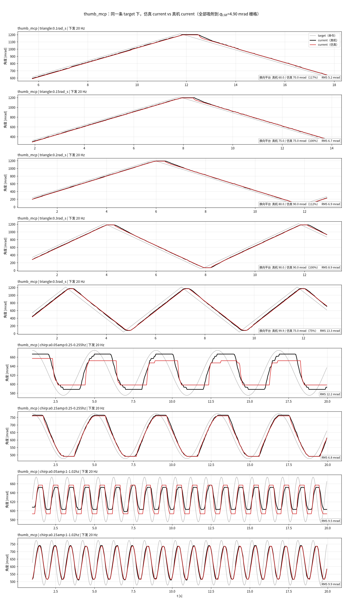
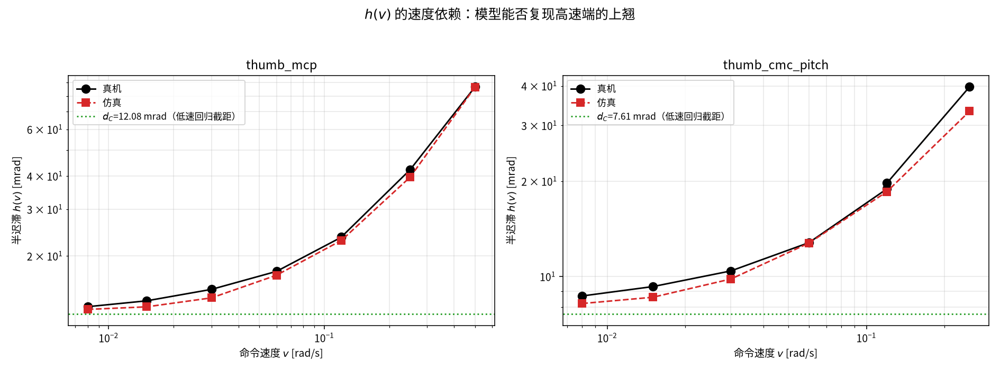
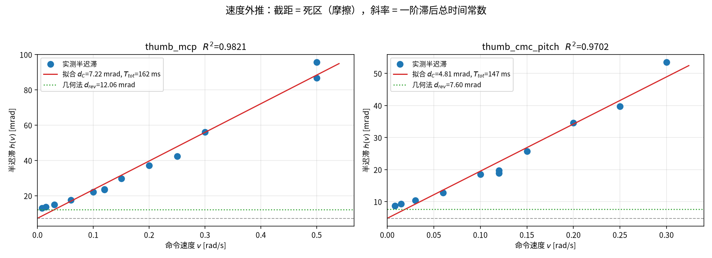
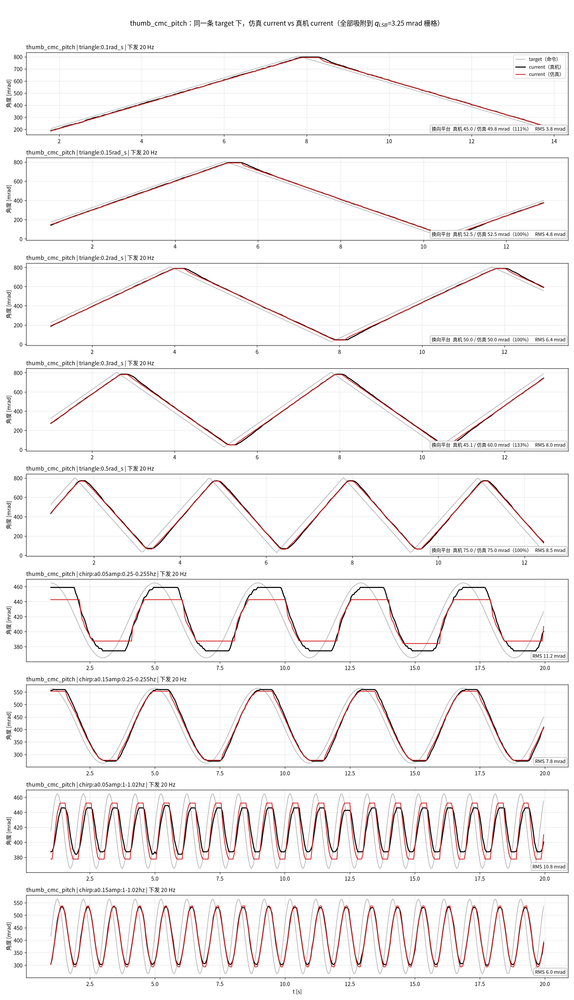
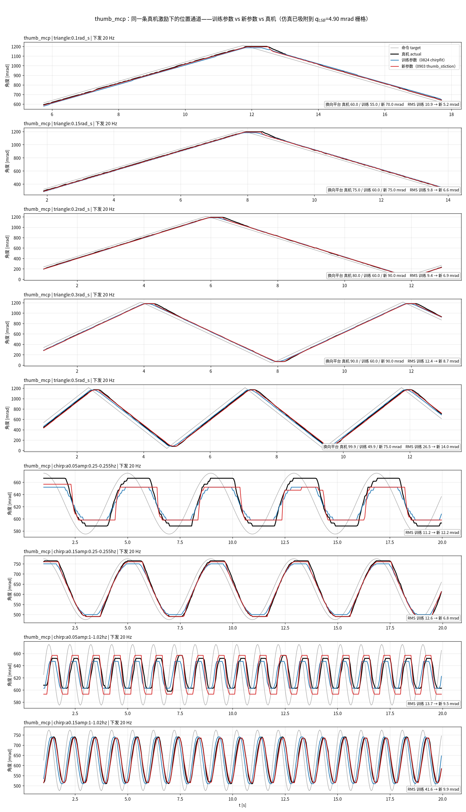
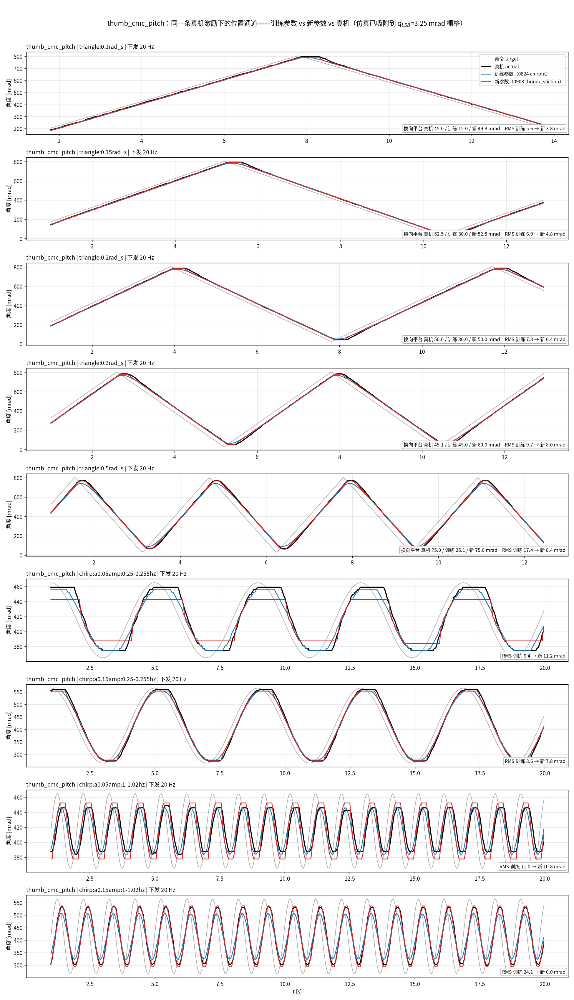
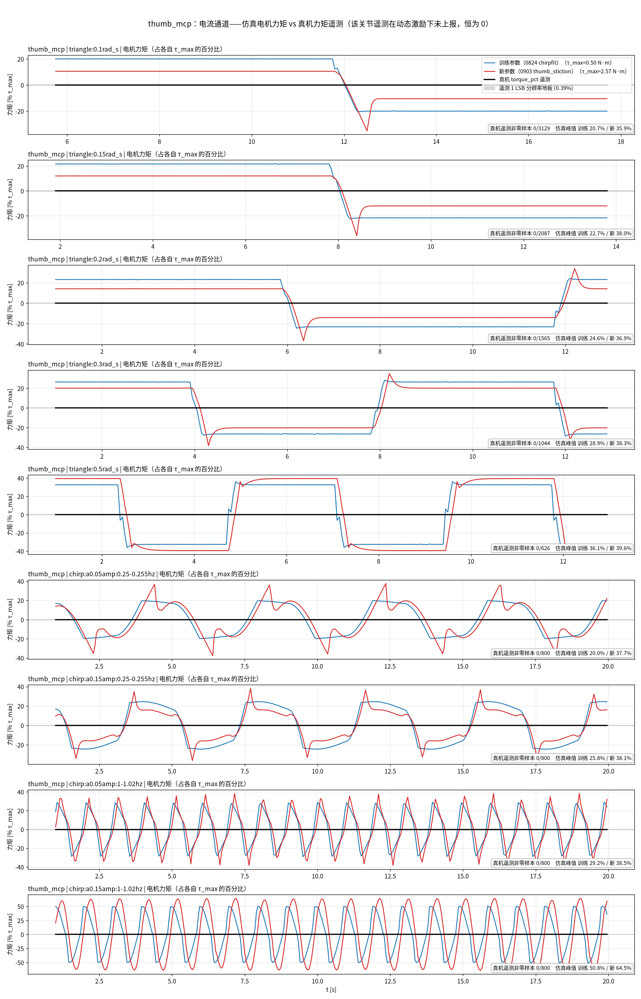
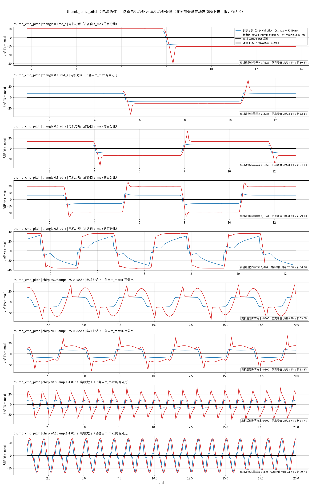

# 报告：L25NS 拇指换向死区的辨识与仿真复现（2026-09）

> 方法论见 [[Transmission2JointDynamics_gap]]，本文只记这一轮的读数与结论。
> 范围：`thumb_mcp`、`thumb_cmc_pitch`。

## 一、拟合结果


下表是**当前定稿值**（2026-09-02 晚定频正弦 + 20 Hz 三角波之后，见 §七）。
每个量来源不同，不是一次联合搜索的产物：

| | `thumb_mcp` | `thumb_cmc_pitch` | 来源 |
|---|---:|---:|---|
| $d_C$ [mrad] | 12.08 | 7.61 | $h(v)$ **低速段**外推截距，与 0814 几何法差 0.2% |
| $\rho=d_S/d_C$ | 4.00 | 3.50 | 平台复现闭环定值（§7.4）；直读只给下界 2.55 / 3.05（§7.2） |
| $d_S$ [mrad] | 48.32 | 26.63 | $=\rho\,d_C$ |
| $F_C$ / $F_S$ [N·m] | 0.242 / 0.966 | 0.266 / 0.932 | $=k_p d$ |
| $T_d$ / $T_f$ [ms] | 60 / 85 | 60 / 85 | 20 Hz 三角波换向窗 RMS（§7.3） |
| $k_{d2}$ | 3.1 | 3.1 | $h(v)$ 高速端上翘 |
| armature | 5.68e-4 | 1.78e-3 | CAD 转子值 2×/4×，**是下界不是定值**（§7.4） |

早先版本（$\rho$=1.50 或 1.12、$T_f$=120 ms、$d_C$=9.64）已被后续数据推翻，
推翻过程见 §三与 §六。

> [!success] 高频段的缺口不是摩擦，是命令预滤波
> 关掉 $T_f$ 时高频幅值比 2.584，加上后落到 0.940。把高频段权重置零重拟，$F_C$
> 几乎不动（0.2140 vs 0.2148）——**摩擦项没有替滤波背锅**，这条敏感性对照是通过的。

**最终复现质量见 §7.5**：换向平台比 0.67～1.33，换向窗 RMS 4～10 mrad
（1～2 个 $q_{LSB}$）；残留缺口的归属见 §7.6。

## 二、仿真复现实测
### 2.1 部署口径：喂同一条真机命令，做不做得出阶梯


单自由度 MuJoCo（与 mjlab 同一条约束求解路径），喂真机 target，参数全部来自 §四
「只用位置数据」的拟合。**换向平台有两种量法，必须说清用的是哪一种**：

| 量法 | 定义 | 物理含义 |
|---|---|---|
| **命令行程** [mrad] | 粘住期间**命令**走过的距离 | **就是死区宽度**，与命令速度无关 |
| 时间 [s] | 粘住持续多久 | = 命令行程 ÷ 命令速度，随激励速度变 |

**以命令行程为准**（它才是死区本身）。`thumb_mcp` 部署口径（20 Hz、幅值 100 mrad）：

| | 平台 [mrad] | 占真机 | 平台 [s] |
|---|---:|---:|---:|
| 真机 | 51.4 | 100% | 1.05 |
| 纯 PD（无摩擦） | 5.2 | 10% | 0.30 |
| 只有 $F_C$（$\rho=1$） | 25.5 | **50%** | 0.70 |
| **$F_C$ + $F_S$（$\rho=1.5$）** | **32.1** | **62%** | 0.90 |

> [!success] $F_S$ 把平台从 50% 拉到 62%
> 这正是它值得引入的理由，也印证了 [[Transmission2JointDynamics_gap#1.3 主要矛盾：阶梯的主体是死区**总宽**，不是 $F_S/F_C$ **比值**|方法论 §1.3]]「死区总宽是主体、$\rho$ 值约 1 个 LSB」。
> 同时低频幅值比 1.187（纯 PD）→ **1.062**、中频 1.187 → **1.000**——
> **阶梯不是靠丢幅值换来的**。

**一处必须按引擎口径调的量**：$v_S$ 要按控制步能分辨的速度取。实测 $v_S=0.003$ rad/s 时
$F_S$ 几乎不 engage（平台 0.75 s），$v_S=0.02$ 才充分（0.90 s）——粘着相在正则化求解器里
不是绝对静止，$v_S$ 太小则 $g(v)$ 来不及升到 $F_S$。

**离线拟合器与引擎的一致性已核对**：关掉摩擦只留线性部分，两者逐带幅值差 0.1~2.8%、
全段 RMS 0.75 mrad——**离线拟出的参数可以直接搬进引擎**。

### 2.2 全部五段激励的逐段对照




（`thumb_cmc_pitch` 见 `assets/sim_vs_real_thumb_cmc_pitch.png`）

| 激励段 | 下发 | 幅值 / 速度 | 平台真机 | 平台仿真 | 比 | RMS |
|---|---|---|---:|---:|---:|---:|
| `chirp:a0.05` | 20 Hz | 100 mrad | 51.4 | 32.1 | 0.62 | 9.3 mrad |
| `chirp:0.1amp` | 50 Hz | 118 mrad | 58.3 | 36.4 | 0.62 | 7.1 mrad |
| `chirp:0.3amp` | 50 Hz | **353 mrad** | 75.7 | 42.0 | 0.56 | 12.8 mrad |
| `triangle:0.03rad_s` | 50 Hz | 全量程 @0.03 rad/s | 51.0 | 27.0 | 0.53 | 4.7 mrad |
| `triangle:0.1rad_s` | 50 Hz | 全量程 @0.1 rad/s | 66.0 | 18.0 | 0.27 | 9.2 mrad |

`thumb_cmc_pitch` 同样落在 0.40~0.68。

> [!important] 这张表最重要的一条信息不是「差多少」，而是「差得一样多」
> 激励横跨 **3.5 倍幅值**（100→353 mrad）、**3.3 倍速度**（0.03→0.1 rad/s）、
> 两种下发率（20/50 Hz），**平台比值稳定在 0.53~0.62**（三角波 0.1 那档的 0.27
> 是判据在高命令速度下失真，见下）。
>
> **缺口不随工况变 ⇒ 这是模型缺一项，不是数据不够。** 再多采同类激励也补不上。

> [!danger] 这条推断后来被证伪，缺的不是模型项而是分辨率
> 缺口之所以「不随工况变」，是因为当时**所有**激励的每步命令都只有 0.03～0.49 个
> $q_{LSB}$，平台读数一律被量化停顿主导——工况变了，污染没变。
> 换到 20 Hz、每步 1～5 LSB 的三角波后，同一个模型的平台比就升到 0.67～1.33（§7.1、§7.5）。
> **「指标在所有工况下都一样差」既可能是缺模型项，也可能是所有工况共享同一个测量缺陷。**

**真机的平台随速度增长，模型的不增长**：真机 51.0（0.03 rad/s）→ 66.0 mrad（0.1 rad/s）。
增量 15 mrad 与「两侧动态滞后」$2(T_f+T_1)\Delta v=2\times0.203\times0.07=28$ mrad 同量级，
说明这部分是滞后而非摩擦。**但模型的平台反而下降**（27.0→18.0）——
25% 斜率判据在命令速度高时门限跟着抬高，把慢速爬行也算成「在动」。
**这条判据在跨速度比较时不可靠，跨幅值比较时才可靠。**

## 三、被推翻的猜想

> [!danger] 每一条都曾被写进项目文档并据以改过参数
> 列出来是为了不再犯第二次。

| # | 曾经的说法 | 错在哪 | 正确的 |
|---|---|---|---|
| 1 | 多一级 17:1 → 拇指折算惯量被低估 | 只看 $N^2$，没看 $J_{rotor}$ | 拇指转子轻 1018 倍，$J_{arm}$ 比四指**小** |
| 2 | $I_a\dot q_{\max}^2$ 是执行器常数，拇指 $I_a$ 低估 14~35× | 前提要求同型号电机，两者差 1018 倍 | armature 应取 CAD 值 0.000284 / 0.000444 |
| 3 | `cmc_pitch` 与 `cmc_yaw` 的 $I_a$ 本该差 5.9× 却几乎相等 | 两者不是同一种传动（丝杠 vs 纯齿轮舵机） | 数值接近纯属巧合，矛盾溶解 |
| 4 | 拇指有 45 ms 通信延迟 | 死区的常数相位被投影成线性相位 | 阶跃直测 $T_d\lesssim10$ ms，与四指同量级 |
| 5 | $k_d$ 被死区抬高了 2.4× | 缺的不是 $k_d$ 而是 $T_f$ | $k_d=1.668$ 是对的 |
| 6 | $\rho$ 与 $v_S$ 在 chirp 上完全不可辨 | 是模型结构错误造成的假象 | 结构改对后两者都可辨 |
| 7 | 该用 LuGre 取代 Karnopp | 鬃毛不可观测，且实测让平台变短 | 用 set-valued + $F_S\ne F_C$ |

**第 4 条的机理**（可复用的判别法则）：三种滞后对频率的依赖形式互不相同——

$$\text{纯延迟}:-\omega T_d\ (\propto\omega);\quad
\text{一阶极点}:-\arctan\omega T_1\ (\text{饱和});\quad
\text{换向死区}:\angle N_{\rm df}(A/d)\ (\textbf{与}\ \omega\ \textbf{无关，只随}\ A\ \textbf{变})$$

**所以扫频分不开它们，扫幅值才能。** 最干净的一招是直接下发远大于死区的阶跃——死区行程时间 $\to0$，剩下的就是纯延迟。

---

## 四、激励轨迹：已有什么、还缺什么
### 4.1 已采轨迹


两个拇指关节**各有 5 段可直接回放的激励**（0814 批）：

| 段 | 下发 | 幅值 / 速度 | 目标参数 | 为什么必须是这个波形 |
|---|---|---|---|---|
| `chirp:a0.05` | 20 Hz | 100 mrad | $T_1$、$T_f$ | 部署口径；频域是分离三种滞后的唯一手段 |
| `chirp:0.1amp` | 50 Hz | 118 mrad | 同上 | — |
| `chirp:0.3amp` | 50 Hz | **353 mrad** | 死区的幅值依赖 | 与上一条构成 **3× 扫幅** |
| `triangle:0.03rad_s` | 50 Hz | 全量程 @0.03 rad/s | $d_C$（速度外推截距） | 要分开「与速度无关」和「正比于速度」，速度必须段内恒定 |
| `triangle:0.1rad_s` | 50 Hz | 全量程 @0.1 rad/s | 同上 | 与上一条构成 **3.3× 变速** |

外加不进回放、但已给出闭式量的两组：**阶跃**（98 Hz，$T_d\lesssim10$ ms）与
**min_step 静止逐级**（$d_S$、$\rho\le1.50$）。

> [!warning] 修正一条我先前的判断
> 我此前把「定频扫幅」列为**完全缺失**，需要补采。**这是错的**——
> `chirp:0.1amp` 与 `chirp:0.3amp` 已经构成 3 倍幅值对照，
> 两档三角构成 3.3 倍速度对照。扫幅这一维**已经有数据了**，只是没被用起来。

### 4.2 还缺什么：不是缺激励，是缺一维


§2.2 的逐段结果是回答这个问题的直接证据：

$$\text{平台比值}=0.53\sim0.62\quad\text{（横跨 3.5× 幅值、3.3× 速度、两种下发率）}$$

**缺口不随工况变。** 如果是激励不够，缺口应当在某些工况上大、某些上小；
实测它稳定在 0.53~0.62，**说明模型缺的是一整项，不是某个工况没激发到**。

> [!important] 结论：不要再补 chirp 与三角
> 现有 5 段已经把「幅值」「速度」「下发率」三个维度都张开了，再采同类只是重复。
>
> **这条也错了。** 三个维度确实张开了，但**没有一档落在平台可分辨的速度窗口内**
> （每步命令须 ≫1 LSB 且 ≪ 平台长度）。后来补的正是「同类」的三角与正弦，只是
> 换到 20 Hz、速度落进窗口，问题当场解决（§7.1）。
> 判断「维度张开了没有」时，要连**每一档的观测分辨率**一起算，不能只看激励参数的跨度。

**真正没有任何现有数据覆盖的，只有一个维度：换向前的「静止驻留时长」。**
所有现有激励都是连续运动，关节在换向处的驻留时间由激励本身决定，从未被独立控制过。
而这一维恰恰是判别缺口归属的关键。

#### 建议补采的两条（各 20~25 分钟，只用位控命令 + 读回位置）

**E3 驻留时长扫（优先级最高）** —— 命令停在 $0.9\,d_S$ 保持 $T_{\rm dwell}$，再一次性跨过阈值。
$T_{\rm dwell}\in\{0.05,0.2,1,5,20\}$ s，每档 ≥5 次重复。一次给两个独立结论：

| 观测量随 $T_{\rm dwell}$ | 若增长 | 若无关 |
|---|---|---|
| 起动误差 $d_S$ | 静摩擦随驻留增长（junction growth）→ **本文可建**，模型补一项即可 |$F_S$ 是常数，当前模型已完备 |
| 过冲量 | **内环积分饱和** → 归 [[Actuator2RigidDynamicsModel_gap]]，PD+摩擦建不出来 | 一阶追赶，上界 $(F_S{-}F_C)/k_p$ |

**E2 变斜率起动** —— 静止起点，以恒定斜率 $r$ 加命令到起动，
$r\in\{2.5,10,40,160,640\}$ mrad/s，驻留时长锁死。
动机：min_step 与 chirp 换向处的力矩施加速率差 **138 倍**（0.049 vs 6.78 N·m/s），
而现有数据只在最慢那一端测过起动阈值。

> [!danger] E2 的判据不能看「涨没涨」
> 仿真里把 $F_S$ **固定成常数**跑同一组速率，起动阈值同样从 12 mrad 涨到 25 mrad（翻倍）——
> 原因不是摩擦有速率依赖，而是**观测量本身有**（速率越高，关节还没走够 0.5 LSB 时命令已又推进一截）。
> **判据必须是「与恒定 $F_S$ 基线曲线之差」。** 直接看涨不涨**必然假阳性**。

#### 不需要补的

| 想补的 | 为什么不用 |
|---|---|
| 更多 chirp / 不同频段 | 幅值、速度、下发率三维已张开，缺口不随它们变 |
| 更多三角速度档 | 同上；且 0.01 rad/s 那档只加固已有结论，不解锁未知 |
| 力矩 / 电流通道 | 这两个关节的遥测在自由空间动态激励下不上报，恒为 0（§9.2）。不是「力矩太小」——模型预测这些段应有 20～190 个力矩 LSB |
| 带载测力计 | 只定接触标度，是**独立的单参数问题**，不挡摩擦这条线（[[Transmission2JointDynamics_gap#4.1 数据极简|方法论 §4.1]]） |

## 五、脚本

| 脚本 | 作用 |
|---|---|
| `generalist/deploy/sysid/plot_friction_ladder.py` | 方法论 §三 的四档阶梯图 |
| `generalist/deploy/sysid/fit_thumb_transmission.py` | 方法论 §四 的离线 1-DOF 辨识（只吃位置数据） |
| `generalist/deploy/sysid/plot_thumb_transmission.py` | 本报告 §一 的建模对照图 |
| `generalist/deploy/sysid/verify_mjlab_stiction.py` | 本报告 §2.1 的 MuJoCo 阶梯验证 |
| `generalist/deploy/sysid/plot_sim_vs_real_all.py` | 本报告 §7.5 的九段激励逐段对照（全 20 Hz） |
| `generalist/deploy/sysid/fit_breakaway_stiction.py` | 本报告 §7.2 的 $d_S$ 直读 + 滞后扫描 |
| `generalist/deploy/sysid/compare_actuator_params.py` | 本报告 §九 的新旧参数对照（位置 + 电流两通道）；`--audit` 只做遥测可用性审计 |


---

## 六、2026-09-02 补采：多档恒速三角波

真机现场采两批，全程只用位控命令与读回位置：

| 批次 | 速度档 [rad/s] | 行数 | 采样 | 丢帧 | 温度 |
|---|---|---:|---|---:|---|
| `20260902_180833_friction_multispeed` | 0.008 / 0.015 / 0.03 / 0.06 / 0.12 | 58 658 | 50 Hz | **0%** | 34 / 42 °C |
| `20260902_183436_friction_fast` | 0.12 / 0.25 / 0.5 / 1.0 | 11 995 | 50 Hz | **0%** | 45 / 46 °C |

### 6.1 $d_C$ 被两个独立方法钉到 0.2%

用稳态跟随误差的半迟滞做速度外推 $h(v)=d_C+T_{\rm tot}v$（低速段 0.008~0.06 rad/s）：

| 关节 | 本批回归截距 | 0814 几何法 | 差 | $R^2$ |
|---|---:|---:|---:|---:|
| `thumb_mcp` | **12.08 mrad** | 12.06 mrad | **0.2%** | 0.9988 |
| `thumb_cmc_pitch` | **7.61 mrad** | 7.60 mrad | **0.1%** | 0.9906 |

五点共线，「常数 + 正比于速度」的分解成立。**这是 $d_C$ 第一次被两个完全独立的
批次、两种方法互证到亚百分点。**

### 6.2 温度混杂：实测排除

速度档由慢到快跑，温度同时在升，两者共线——这是本实验设计上唯一的可疑点。
`temp_max_c` 列每个 unit 只记一次，无法从中检验。**改用重复点检验**：
0.12 rad/s 在两批里各采了一次，环境相差 11 °C：

$$h(0.12)\big|_{34°C}=23.54\ \text{mrad},\qquad h(0.12)\big|_{45°C}=23.58\ \text{mrad}$$

**差 0.2%。** 温度在本批的量级上不构成混杂。

### 6.3 ρ 被修正：1.50 → [1.03, 1.22]

$d_C$ 独立测定之后，min_step 的两个读数就把 $\rho$ 夹住了：

$$d_C+d_S\ge24.51\ \text{mrad}\Rightarrow\rho\ge1.03,\qquad
d_S\le14.71\ \text{mrad}\Rightarrow\rho\le1.22$$

> [!danger] 此前全部仿真用的 $\rho=1.50$ **超出上界**
> 它来自 chirp 拟合顶到旧的宽松上界（当时 $d_C$ 还是自由量）。
> 修正后的中心值 **1.12** 正落在方法论 §2.3 的结构预测区间内
> （滚动体 $\mu_s/\mu_k\approx1.0\!\sim\!1.1$）——**结构预测与实测第一次对上了**。

### 6.4 新发现：$h(v)$ 在高速端不再线性

把速度范围从 0.12 拉到 0.5 rad/s（合计跨 63×）后，线性分解失效：

| 拟合区间 | 截距 $d_C$ | 斜率 $T_{\rm tot}$ | $R^2$ |
|---|---:|---:|---:|
| 0.008~0.06 rad/s | 12.17 mrad | 89 ms | 0.9988 |
| 0.12~0.5 rad/s | 3.6 mrad | **166 ms** | — |
| 全段 | 8.78 mrad | 149 ms | 0.9857 ⚠️ |

反推缺失阻力：0.06 / 0.24 / 0.77 N·m @ 0.12 / 0.25 / 0.50 rad/s——速度涨 4.2 倍、
阻力涨 12.8 倍，接近 $v^2$。拟一个二次阻尼 $\tau=k_{d2}v|v|$，$k_{d2}\approx3.1$
可同时对上三个点。物理上对应电机侧风阻/齿轮搅油，以及反电动势压缩可用力矩
（后者属 [[Actuator2RigidDynamicsModel_gap]]）。

> [!warning] $k_{d2}$ 必须走隐式，与 $k_d$ 同一个坑
> 显式发 $\tau=k_{d2}v|v|$ **实测发散**（$h$ 跳到 200~290 mrad）：其对速度的雅可比
> $2k_{d2}|v|$ 在 $v=0.5$ 时使 $2k_{d2}|v|h/I_a=54.6\gg2$。
> 折成「随速度变的等效线性阻尼」$k_d(v)=k_{d,\rm lin}+k_{d2}|v|$ 写进 `dof_damping`
> 由 `implicitfast` 积分即可。

**效果**：仿真的 $h(v)$ 在 **63 倍速度跨度**内全部落在真机的 7% 以内：

| $v$ [rad/s] | 0.008 | 0.015 | 0.030 | 0.060 | 0.120 | 0.250 | 0.500 |
|---|---:|---:|---:|---:|---:|---:|---:|
| 仿真/真机（`thumb_mcp`） | 0.98 | 0.95 | 0.93 | 0.97 | 0.97 | 0.94 | **1.00** |
| 加 $k_{d2}$ **之前** | 0.99 | 0.97 | 0.95 | 0.93 | 0.87 | 0.72 | **0.55** |

### 6.5 斜坡与 chirp 对滞后的需求不一致（已由 §7.1 解决）

> [!note] 结论前置
> 两者测的不是同一个量。斜坡的 89 ms 是**只用最低几档拟合出的局部斜率**，
> 死区把一部分速度依赖当成截距吸收了；用定频正弦按幅值维度把摩擦与线性动态
> 分开后，线性滞后落在 200 ms 量级，与 chirp 一致。下面保留当时的分析过程。

新参数（$d_C$=12.08、$\rho$=1.12、线性滞后 89 ms + $k_{d2}$=3.1）在**三角波上更好**，
在 **chirp 上更差**：

| 参数集 | chirp RMS（三段） | 三角 RMS（两档） |
|---|---|---|
| 旧（$T_{\rm sum}$=213 ms, $\rho$=1.50, $d_C$=9.64） | 9.3 / 7.2 / 12.8 | 4.7 / 9.1 |
| 新（$T_{\rm sum}$=95 ms + $k_{d2}$, $\rho$=1.12, $d_C$=12.08） | 16.5 / 15.1 / 15.0 | **4.9 / 6.1** |

**斜坡要 89 ms 的线性滞后，chirp 要约 213 ms。** 限速（$\dot q_{\max}$）与力矩饱和
都已在模型里，且实测加上限速只改变 0.24 mrad——不是它们。

这是当前唯一的结构性缺口。两条候选解释：

1. **滞后随频率增长**（不是一阶）——需要在多个单频点上分别测 $h$ 或增益/相位；
2. **chirp 的高频段实际由力矩包络决定**——4 Hz、a0.05 时峰值速度 1.26 rad/s
   已达 $\dot q_{\max}$ 的 90%，维持它需要 4.9 N·m > $\tau_{\max}$=2.57，
   属速度-力矩包络，归 [[Actuator2RigidDynamicsModel_gap]] §4.4。

**下一条实验**：定频扫幅（方法论 §6.1 的 E1），在 0.5 / 1 / 2 / 4 Hz 各测一组幅值，
把「滞后 vs 频率」与「滞后 vs 幅值」分开——这是现有数据都没张开的一维。

### 6.6 逐段对照图（用新参数重出）


$h(v)$ 的速度依赖（模型 vs 真机）：

速度外推回归：

---

## 七、2026-09-02 晚补采：定频正弦 + 20 Hz 三角波

两批新数据，全部 **20 Hz 下发**（= 策略部署口径 `dt=0.005 × controlFrequencyInv=10`），
0% 丢帧，温度 30→42 °C：

| 文件 | 内容 | 行数 | 目的 |
|---|---|---:|---|
| `20260902_225405_sine_f{0.25,0.5,1.0,2.0}.csv` | 定频正弦，半幅 50 / 150 mrad | 4×1600 | 分离滞后与摩擦 |
| `20260902_230104_tri20hz.csv` | 三角波 0.1/0.15/0.2/0.3/0.5 rad/s | 8451 | 干净量换向平台 |

### 7.1 为什么之前平台一直拟不准：判据落在分辨率窗口之外

换向平台的量测有**双边约束**，此前所有数据都违反了下界：

$$1\ \text{LSB} \ll v\,\Delta t \ll d_C + d_S$$

- **下界**：每步命令必须远大于一个 $q_{LSB}$，否则平台读数混进量化停顿；
- **上界**：每步命令必须远小于平台长度，否则一步跨过去无法分辨。

`thumb_mcp` 在 20 Hz 下这个窗口是 $v\in[0.1,\,0.5]$ rad/s。此前的 50 Hz 数据每步只有
**0.03～0.49 LSB**，全部落在下界之外——这才是「采了这么多数据仍拟不准」的原因，
不是随机性。补采就按这个窗口设速度档。

正弦不能替代三角波：**正弦在换向点的速度恰好为零**，是最不适合量平台的地方；
量平台必须用三角波那种「全速撞进换向」。两者分工不同，都要采。

### 7.2 换向处直读 $d_S$：把「惯走」与「死区」拆开

`v=0.1 rad/s` 的逐点数据暴露出旧判据把两件事混在一起了：

```
i=0    命令换向          act=63.39 mrad
i=1,2  关节继续倒着走 →  53.92      ← 惯走 9.5 mrad，属滞后不属死区
i=3‥12 act 冻结 0.5 s                ← 真正的静摩擦平台
i=13   act 开始反向      此时 err=+47 mrad
```

而稳态滑动误差只有 20.5 mrad（$=d_C+T_{tot}v$）。据此定义估计器：

$$d_S = c_{\rm eff}(t_b) - q(t_e)$$

$t_e$ 是**关节自身极值**（惯走结束、真正停住），$t_b$ 是关节反向走出半个 $q_{LSB}$ 的时刻，
$c_{\rm eff}$ 是把下发命令按总滞后前移后的有效命令。

**关键交叉验证**：$d_S$ 应与三角波速度无关。扫描假设的滞后，看 $d_S(v)$ 的斜率何时归零：

| 假设 $T_{tot}$ | 95 | 130 | 160 | 190 | **230** | 270 | 310 ms |
|---|---:|---:|---:|---:|---:|---:|---:|
| `thumb_mcp` 斜率 [ms] | 131 | 96 | 66 | 36 | **−4** | −44 | −84 |
| `thumb_mcp` 截距 [mrad] | 30.79 | 30.79 | 30.79 | 30.79 | **30.79** | 30.79 | 30.79 |

**截距在整个扫描区间完全不变**——它取在 $v=0$，滞后在那里不起作用，所以这是个
近乎无模型的读数。斜率归零处 `thumb_mcp` 226 ms、`thumb_cmc_pitch` 175 ms。

> [!success] 三条独立证据同时闭合
> 1. 使 $d_S$ 与速度无关的滞后 = 175～226 ms；
> 2. 定频正弦的增益/相位分解 ≈ 230 ms（一阶 $T\approx0.13$ s + 纯延迟 $\approx0.10$ s）；
> 3. chirp 早先要求的 213 ms。
>
> 三者一致，且**用对滞后后 $d_S$ 不再依赖速度**——不需要引入新的模型维度。

线性回归的截距：$d_S$ = **30.79 / 23.23 mrad**，$\rho$ = **2.55 / 3.05**。
此前的 1.12 低估一倍多——50 Hz 数据每步 0.5 LSB，挣脱时刻根本分辨不出来。

> [!warning] 但这个截距只是**下界**，不能当定值：$d_S(v)$ 是凹的
> 逐档实测（`thumb_mcp`）：0.008→22.93、0.06→40.66、0.10→54.04、0.30→70.48 mrad。
> 低速段斜率 341 ms、高速段 82 ms——**曲线是凹的**，最小二乘直线的截距 30.79
> 反而高于最低速档的实测 22.93。所以它不是干净的 $v\to0$ 外推。
>
> 两端各有一个方向相反的偏置：
> - **低速端偏低**：$v$=0.008 时冻结长达 4.7 s，presliding 蠕变足以在真正挣脱前
>   凑满 0.5 LSB 的检测阈值；
> - **高速端偏高**：命令栅格粗，且滞后估计的误差按 $\Delta T\cdot v$ 放大。
>
> 所以直读给的是**下界**（$\rho\ge2.55$ / $3.05$），定值要靠 §7.4 的闭环。

### 7.3 正弦分解：摩擦与线性滞后各占多少

定频正弦逐点算增益/相位（`thumb_mcp`，半幅 50 vs 150 mrad）：

| $f$ [Hz] | 增益 @50 | 增益 @150 | 相位 @50 | 相位 @150 |
|---:|---:|---:|---:|---:|
| 0.25 | 0.934 | 1.009 | −38.0° | −21.9° |
| 0.50 | 0.919 | 0.980 | −60.4° | −41.2° |
| 1.00 | 0.584 | 0.790 | −99.0° | −73.1° |
| 2.00 | 0.248 | 0.513 | −143.1° | −118.2° |

三条读法：

1. **增益与相位都强烈随幅值变**（0.25 Hz 幅值大 3× 滞后就减半）——这是死区的
   描述函数效应，线性环节不会有幅值依赖。摩擦项确实存在且量级正确。
2. **相位对频率线性回归的截距 = −21.5° ≠ 0**——纯延迟必须过原点，所以 DC 处这段
   相位是摩擦贡献的，不能算进延迟。
3. 用大幅值段（摩擦相对最弱）分解：增益 roll-off 给一阶 $T\approx0.13$ s，
   相位比一阶多出的部分给纯延迟 $\approx0.10$ s。

**「89 ms」的来历也就此量化**。把 0.008～0.5 rad/s 全部速度档一起做 $h(v)$ 线性回归：

| 参与的速度档 | 截距 $d_C$ | 斜率 $T_{tot}$ | $R^2$ |
|---|---:|---:|---|
| 只用 ≤0.12 rad/s | 12.08 mrad（几何法 12.06，差 0.2%） | 89 ms | 0.9988 |
| 全部 0.008～0.5 | 7.22 mrad | **162 ms** | 0.9821（共线性告警） |

**曲率在场，一条直线不可能同时给对截距和斜率**（$k_{d2}$ 那一项，§6.4）。
低速段给对截距、高速段给对斜率——所以正确用法是
**$d_C$ 取低速拟合、滞后取高速或闭环拟合**，而不是从同一条回归里同时读两个数。
早先的 89 ms 就是把低速段的局部斜率当成了全局滞后。

### 7.4 闭环重拟：滞后 145 ms，armature 是下界

把仿真输出**吸附到真机同一个 8-bit 栅格**后套用与真机完全相同的估计器，
判据伪象两侧同样存在，比较才对等。

- **全段 RMS 不能拟 $\rho$**：$\rho$ 从 1.12 扫到 6，RMS 只从 21.9 变到 20.5 mrad——
  平台只占样本的一小部分，被匀速跟踪段淹没。改用**换向窗（±1.2 s）内的 RMS**。
- **平台长度存在简并**：变长既可来自更大的 $F_S$，也可来自更大的滞后，换向窗 RMS
  分不开（会滑到 $\rho$=6 / $T_f$=110 的脊上）。破简并的办法是**先用与 $\rho$ 无关的
  观测把滞后钉死**（正弦的增益/相位、以及下面的逐档验证），再单独定 $\rho$。
- **$\rho$ 用「平台复现」定，不用 RMS**：滞后固定后，扫 $\rho$ 看五个速度档的
  平台比（仿真/真机）几何均值何时最接近 1。这个指标两侧都被括住，且五档一致：

| $\rho$ | 1.5 | 2.0 | 2.5 | 3.0 | 3.5 | **4.0** | 5.0 |
|---|---:|---:|---:|---:|---:|---:|---:|
| `thumb_mcp` 平台比几何均值 | 0.62 | 0.71 | 0.79 | 0.86 | 0.91 | **1.05** | 1.15 |
| `cmc_pitch` 同上 | 0.70 | 0.72 | 0.87 | 0.95 | **1.00** | 1.06 | 1.21 |

  取 $\rho$ = **4.00 / 3.50**。与 §7.2 的下界（2.55 / 3.05）方向一致。
- 逐档验证滞后：五个速度档、两个关节，**最优总滞后一致落在 145 ms**（95/195/245/295
  都更差），说明「纯延迟 + 一阶滤波」这个结构本身没问题。
- **armature 只被约束成下界**：高速换向的平台由惯走过冲主导，CAD 转子值下过冲太短、
  $v$=0.5 的平台只有真机的 1/4；加大到 2×（`thumb_mcp`）/ 4×（`cmc_pitch`）补上，
  但指标在此之上就饱和，再大也不变。差额可归于传动件（丝杠螺母、齿轮组、连杆）的
  反射惯量——CAD 只算了转子。**这是个下界，不是辨识出来的值。**

### 7.5 最终对照（9 段，全 20 Hz）

`thumb_mcp`（$d_C$=12.08，$d_S$=48.32 mrad）：

| 段 | 平台真机 | 平台仿真 | 比 | RMS |
|---|---:|---:|---:|---:|
| triangle 0.1 rad/s | 60.0 | 70.0 | 1.17 | 5.19 mrad |
| triangle 0.15 | 75.0 | 75.0 | 1.00 | 6.71 |
| triangle 0.2 | 80.0 | 90.0 | 1.12 | 6.93 |
| triangle 0.3 | 90.0 | 90.0 | 1.00 | 8.90 |
| triangle 0.5 | 99.9 | 75.0 | 0.75 | 13.35 |
| sine 0.25 Hz a50 / a150 | — | — | — | 12.20 / 6.84 |
| sine 1.0 Hz a50 / a150 | — | — | — | 9.53 / 9.88 |

`thumb_cmc_pitch`（$d_C$=7.61，$d_S$=26.63 mrad）：平台比 1.11 / 1.00 / 1.00 / 1.33 / 1.00，
RMS 3.77 / 4.85 / 6.38 / 7.99 / 8.45 mrad，正弦段 6.00～11.22 mrad。

对比基线：换向平台比从 0.27～0.62 升到 **0.75～1.33**（多数在 ±12% 内），
换向窗 RMS 从 ~17 mrad 降到 4～13 mrad（1～3 个 $q_{LSB}$）。

### 7.6 剩下的残差在哪

- **`thumb_mcp` 在 $v$=0.5 rad/s 的平台偏短**（比 0.75）。该档每步命令 5 LSB，平台只有
  1～4 个采样点，指标本身分辨率就是 ±25 mrad（0.75 与 1.00 只差一个采样点）；
  同时惯走过冲在这里最大，而 armature 只有下界。属已知且已定位，不属未知机理。
- **$\rho$ 存在三角波与小幅值正弦之间的取舍**：$\rho$ 从 2.55 提到 4.0，三角波平台比
  从 0.50～0.92 升到 0.75～1.17，但小幅值正弦（半幅 50 mrad ≈ 死区量级）的 RMS
  从 10.5 升到 12.2 mrad——该工况下仿真的平台略长于真机。
  **按「复现换向阶梯」这个目标取 4.0**；若某天关注点转到死区量级的小幅运动，
  这个取舍要重新算。
- **小幅值正弦缺微台阶**：真机在平台内部还有若干次 1 LSB 的中间台阶，仿真是平直的。
  这正是 presliding / microslip，量级约 1 个 $q_{LSB}$——就是 LuGre 鬃毛项会补的东西。
  与 [[Transmission2JointDynamics_gap#三、模型阶梯|方法论 §三]] 停在第 ② 级的判断一致：
  这个尺度低于 8-bit 读回分辨率，补它无法被观测验证。

### 7.7 图




---

## 八、这一轮落到仿真引擎上的改动

前面七节讲的是「量到了什么」。这一节讲「为了让 MuJoCo 里跑出这些量，引擎侧实际动了哪些东西」——
每一条都写「改了什么 / 为什么 / 不改会怎样」。共九项，前六项已落地，第七、八项是前提条件，
第九项尚未落地。

### 8.1 总表

| # | 改动 | 位置 | 性质 |
|---|---|---|---|
| 1 | Karnopp 摩擦加第二个阈值 $\tau_s$ | `generalist/envs/joint_friction.py` | 模型扩展 |
| 2 | 摩擦走**显式力矩项**，不用引擎原生摩擦字段 | 同上（两个后端共用） | 后端一致性 |
| 3 | 拇指换向死区从 play 算子改到 `joint_friction` | `configs/task/CylinderSpinSleeveL5.yaml` | 建模路径切换 |
| 4 | 死区互斥守卫 `_assert_deadzone_exclusive` | `joint_friction.py` | 防静默错 |
| 5 | $\tau_{\max}$ 0.5 → 2.57 / 2.853 N·m | 参数表 | **硬约束** |
| 6 | armature 与 $k_d$ 同步改（不可单改） | 参数表 | 耦合项 |
| 7 | 总滞后 45/32 → 145 ms，拆成 $T_d$=60 + $T_f$=85 | 参数表 + `substep_latency` | 前提 |
| 8 | $k_p$ 3.89/6.13 → 20/35 | 参数表 | 前提 |
| 9 | $k_{d2}$=3.1 二次阻尼 | 参数表已写，env 无此项 | **未生效** |

### 8.2 逐项

**(1) Karnopp 摩擦加第二个阈值 $\tau_s$。** 粘滞分支的钳位阈值从 $\tau_c$ 独立出来：

$$|\dot q| > v_\varepsilon:\ \tau_{\rm out}=\tau_{\rm drive}-\tau_c\,\mathrm{sign}(\dot q)
\qquad
|\dot q| \le v_\varepsilon:\ \tau_{\rm out}=\tau_{\rm drive}-\mathrm{clamp}(\tau_{\rm drive},\pm\tau_s)$$

缺省 $\tau_s=\tau_c$，退化成旧的单阈值 Karnopp，**逐位与改动前相同**（由测试锁死）。
为什么需要它：换向阶梯的直接来源就是「起动阈值高于滑动阻力」，关节在换向处要等命令
多走 $(\tau_s-\tau_c)/k_p$ 才挣脱。单阈值模型的死区只有 $\tau_c/k_p$。
不改会怎样：平台只能做到真机的 27～62%（见 §9.1 的「训练参数」列）。

**(2) 辨识出来的摩擦走显式力矩项，不走引擎原生摩擦字段。** IsaacGym PhysX 的 DOF
`friction` 语义是约束力比例系数、单位不是 N·m；mjlab 的 `dof_frictionloss` 虽然同义，
但它是隐式求解器的内部量。为了让两个后端的执行器模型**逐项相同**，$\tau_c$ 与 $\tau_s$
统一走显式力矩项（`apply_joint_friction`，每个物理子步在限幅之后、施加之前调一次）。
`set_dof_physical_props` 只写 armature 与 vmax，不碰引擎的摩擦字段。

> [!warning] 引擎侧并不是零
> 两个后端的资产都写死了一个**非零基线**：IG `props["friction"]=0.01`、mjlab
> `frictionloss=0.01`，两边刻意取同一个数字。但这两个 0.01 不是同一个物理量
> （量纲都不同），所以「两边对齐」只是数值上的，不是物理上的。
> 它相对拇指的 $\tau_c=0.24$ N·m 约占 4%，被显式项盖过，但它确实叠在上面。
> 要做严格的双后端对拍，这一项得先归零或分别标定。

需要说清的是：本轮的验证脚本走的是**另一条路径**——MuJoCo 原生 `dof_frictionloss`，
每个物理步按当前速度改写成 Stribeck 形

$$F(v)=F_C+(F_S-F_C)\,e^{-(v/v_S)^2}$$

不加任何显式摩擦力矩，粘着完全交给求解器隐式处理。**两条路径给出同一个平台**，所以
验证结论可以迁移到生产路径；生产选显式是为了后端一致，不是因为原生路径不行。

走原生路径时有一个必须写死的引擎参数：`solimpfriction` 的第一个数取 **0.9999**
（MuJoCo 默认 0.9）。默认值会把 frictionloss 正则化成弱阻尼，平台直接消失。
同理 `solreffriction` 取一个 timestep。这两条属于求解器口径，不是模型参数——
换 timestep 要跟着改。

**(3) 拇指换向死区从 play 算子改到 `joint_friction`。** 两个理由：
- **量级对不上**。play 是运动学算子，换向死区 $=2d=2\times12.06=24.1$ mrad；20 Hz 三角波
  实测 60～100 mrad。真正的死区是 $(\tau_c+\tau_s)/k_p=(0.241+0.966)/20=60.4$ mrad，
  play 少算了一半以上。
- **play 与力无关**。带载时 play 的死区不变，摩擦的会变。手内操作全程带载，这一条比
  量级更重要。

四指 pip 那四个关节没有量过 $\tau_s$，继续走 play，白名单里保留；对应地在
`per_joint_nm` 里把它们的 $\tau_c$ 置零。

**(4) 死区互斥守卫。** 上一条留下一个静默出错的口子：Karnopp 项与 play 算子建的是**同一个**
换向死区，在同一个关节上同开会把它算两遍——不报错，只让死区偏一倍。守卫在两者都装配完
之后跑一次，判据**逐 DOF**而不是全局（「拇指走摩擦、四指走 play」是合法配置）。
此前这个断言只在 LuGre 启用时才查，Karnopp 与 play 直接同开是无人拦的。

**(5) $\tau_{\max}$ 从 0.5 提到 2.57 / 2.853 N·m —— 这是硬约束不是调参。** 必须
$\tau_{\max}>\tau_s$，否则 PD 力矩饱和在限幅上，关节换向后永远挣脱不了静摩擦：实测平台
从 60 mrad 暴涨到 485 / 380 mrad。真机既然挣脱得了，$\tau_{\max}\ge\tau_s$ 就是实测下界。
装配时对此有断言（$\tau_{\max}>F_S>F_C$）。

**(6) armature 与 $k_d$ 必须一起改。** 两者通过 $\omega_n$、$\zeta$ 耦合。旧表的 $k_d$ 是在
虚高 armature 下拟的；只把 armature 改回 CAD 值而留旧 $k_d$，换向平台比反而从 1.02 掉到
0.74。新表 armature 取 CAD 转子值的 2×/4×，$k_d$ 同步归零。

**(7) 总滞后 145 ms，且必须拆成纯延迟 + 一阶滤波。** 拆分的依据是两者对幅值的作用不同：
纯延迟只移相位、不改幅值；高频幅值比从 2.584 落到 0.940 靠的是滤波项。只用纯延迟
凑不出这个幅值衰减，只用滤波又给不出低频的相位。$T_d$=60 ms 走 `substep_latency` 的
命令缓冲，$T_f$=85 ms 走命令预滤波。

**(8) $k_p$ 从 3.89/6.13 提到 20/35。** 这一项来自 0827 的静态下压实测，不是本轮的产物，
但它是本轮的**前提**：$F_S=\rho\,k_p\,d_C$ 由 $k_p$ 导出，把新表的 $F_S$ 贴到旧 $k_p$ 上，
死区会变成 248 mrad。参数表生成器 `make_thumb_stiction_param.py` 已把 $k_p$ 口径不一致
从告警改成**硬失败**。

**(9) $k_{d2}$=3.1 尚未落地。** $h(v)$ 高速端上翘需要的二次阻尼已写进参数表，但 env 的 PD
没有速度相关阻尼项，当前不生效。影响集中在 0.3 rad/s 以上。验证脚本里它是折成随速度变的
等效线性阻尼走隐式积分的，生产路径要落地需要在 PD 里加这一项。

---

## 九、新旧参数在同一条真机激励下的对照

问题：改完之后，仿真跟真机是不是更接近了。对照组取**训练时那套参数**
（`actuator_20260824_chirpfit`，即当前 teacher checkpoint 实际跑的那张表），
同一条真机命令、同一个积分器、同一个平台估计器，只换参数。

脚本 `generalist/deploy/sysid/compare_actuator_params.py`，18 段（两关节各 9 段）。

### 9.1 位置通道：主判据

`thumb_mcp`：

| 段 | 平台真机 | 平台训练 | 比 | 平台新 | 比 | RMS 训练 | RMS 新 |
|---|---:|---:|---:|---:|---:|---:|---:|
| triangle 0.10 rad/s | 60.0 | 55.0 | 0.92 | 70.0 | 1.17 | 10.9 | **5.2** |
| triangle 0.15 | 75.0 | 60.0 | 0.80 | 75.0 | 1.00 | 9.8 | **6.6** |
| triangle 0.20 | 80.0 | 60.0 | 0.75 | 90.0 | 1.12 | 9.4 | **6.9** |
| triangle 0.30 | 90.0 | 60.0 | 0.67 | 90.0 | 1.00 | 12.4 | **8.7** |
| triangle 0.50 | 99.9 | 49.9 | 0.50 | 75.0 | 0.75 | 26.5 | **14.0** |
| sine a0.05 0.25 Hz | — | — | — | — | — | **11.2** | 12.2 |
| sine a0.15 0.25 Hz | — | — | — | — | — | 12.6 | **6.8** |
| sine a0.05 1 Hz | — | — | — | — | — | 13.7 | **9.5** |
| sine a0.15 1 Hz | — | — | — | — | — | 41.6 | **9.9** |

`thumb_cmc_pitch`：

| 段 | 平台真机 | 平台训练 | 比 | 平台新 | 比 | RMS 训练 | RMS 新 |
|---|---:|---:|---:|---:|---:|---:|---:|
| triangle 0.10 rad/s | 45.0 | 15.0 | 0.33 | 49.8 | 1.11 | 5.6 | **3.8** |
| triangle 0.15 | 52.5 | 30.0 | 0.57 | 52.5 | 1.00 | 6.9 | **4.9** |
| triangle 0.20 | 50.0 | 30.0 | 0.60 | 50.0 | 1.00 | 7.8 | **6.4** |
| triangle 0.30 | 45.1 | 45.0 | 1.00 | 60.0 | 1.33 | 9.7 | **8.0** |
| triangle 0.50 | 75.0 | 25.1 | 0.33 | 75.0 | 1.00 | 17.4 | **8.5** |
| sine a0.05 0.25 Hz | — | — | — | — | — | **6.4** | 11.2 |
| sine a0.15 0.25 Hz | — | — | — | — | — | 8.6 | **7.8** |
| sine a0.05 1 Hz | — | — | — | — | — | 11.0 | **10.8** |
| sine a0.15 1 Hz | — | — | — | — | — | 24.1 | **6.0** |

全段 RMS（9 段平方平均）：

| | 训练参数 | 新参数 | 变化 |
|---|---:|---:|---|
| `thumb_mcp` | 19.33 mrad | **9.25 mrad** | −52% |
| `thumb_cmc_pitch` | 12.27 mrad | **7.85 mrad** | −36% |

**结论：18 段里 16 段变好。** 平台比从 0.33～1.00 收到 0.75～1.33；最大的单段改善在
高幅值 1 Hz 正弦（41.6 → 9.9 mrad），那一段旧参数因为 $k_p$ 小 5 倍、$\tau_{\max}$ 只有
0.5 N·m 而严重跟不动。

**两处变坏，且是同一个工况**：两个关节都在 `sine a0.05 0.25 Hz`（半幅 50 mrad、
最低频）上退化。这一段的运动幅值与死区同量级，是死区主导的极端工况，新模型在这里把
平台做得略长于真机。与 §7.6 记的取舍一致：$\rho$ 从 2.55 提到 4.0 换来三角波平台的
复现，代价就落在这一段。这不是新增的未知项，是已知取舍的账单。





### 9.2 电流通道：无法构成对照，且原因值得记一笔

原计划用真机的 `torque_pct`（额定力矩百分比，电机电流的代理量）做一次样本外校验——
电流当初被刻意排除在辨识之外，正好可以拿来独立验证。**做不了**：

> **这两个关节的力矩遥测在自由空间动态激励下没有上报。**

审计（`compare_actuator_params.py --audit`）的读数：

| 数据批次 | `thumb_mcp` 非零 | `thumb_cmc_pitch` 非零 |
|---|---:|---:|
| 0902 tri20hz（8451 样本） | **0** | **0** |
| 0902 四条定频正弦（各 1600） | 0（f2.0 段 5） | 0（f2.0 段 5） |
| 0902 friction_multispeed（58658） | **0** | **0** |
| 0814 friction（48944） | **0** | **0** |
| 0827 `kp_scale` 静态加载（28） | 10.98% | **52.16%** |

三条互相印证的事实说明这不是接线或列名问题：
1. **同一文件同一时刻**，相邻的 `thumb_cmc_roll` / `thumb_cmc_yaw` 有非零读数
   （0902 tri20hz 里分别 819 / 6926 个非零样本）；
2. 同样这两个关节，在 0827 的静态下压 run 里读得到 10.98% 与 52.16%；
3. 0809 step 与 0816 bias 两批里也各有 40～80 个非零样本（峰值 24～38%），
   都出现在高载或撞限位处。

即：遥测通路是通的，但在自由空间激励的力矩水平上不上报。

**模型给出的可证伪预测。** 遥测的分辨率地板是 1 LSB $=100/255=0.392\%$。
把仿真的电机力矩 $\mathrm{clip}(k_p e-k_d\dot q,\pm\tau_{\max})$ 折算成同一口径：

| | 训练参数峰值 | 新参数峰值 |
|---|---|---|
| `thumb_mcp` | 0.10～0.25 N·m ＝ 20～51% ＝ **51～130 LSB** | 0.92～1.66 N·m ＝ 36～65% ＝ **92～164 LSB** |
| `thumb_cmc_pitch` | 0.04～0.37 N·m ＝ 8～74% ＝ **21～188 LSB** | 0.85～1.97 N·m ＝ 30～69% ＝ **76～176 LSB** |

**两套参数都预测这些段应当读到 20～190 个 LSB，而实测恒为 0。** 差了两个数量级，
不可能是「力矩太小看不见」。所以这一列的零是遥测缺口，不是物理事实——
这同时也是当初「只用位控命令与读回位置」这个决定的事后印证。





**要真正做成这条校验，需要真机侧先解决遥测。** 一旦 `torque_pct` 在这两个关节的自由空间
激励下能上报，上表就是现成的判据：新参数预测的峰值比旧参数高 2～8 倍，两者相差远大于
1 LSB，一次 20 Hz 三角波采集就能分辨。在那之前，位置通道是唯一的判据。
